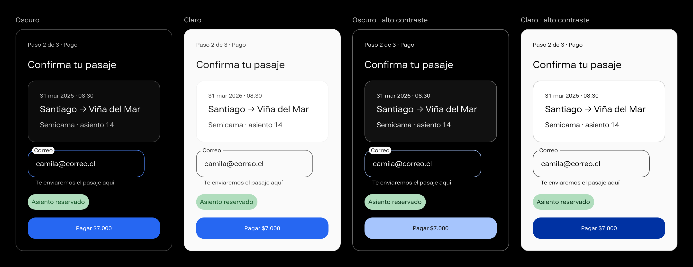
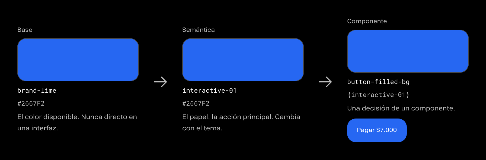
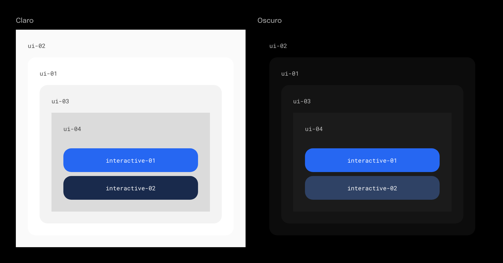
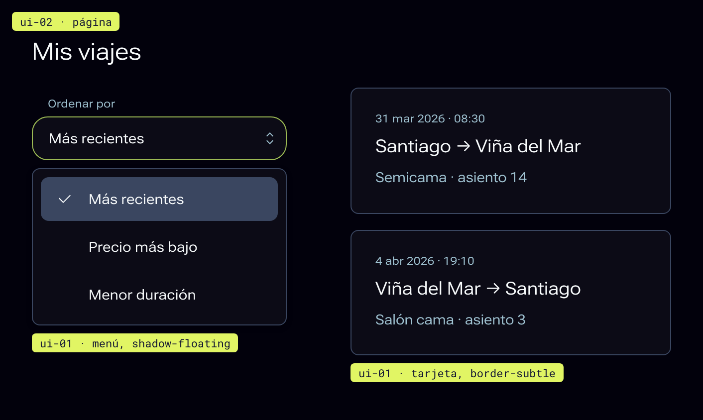
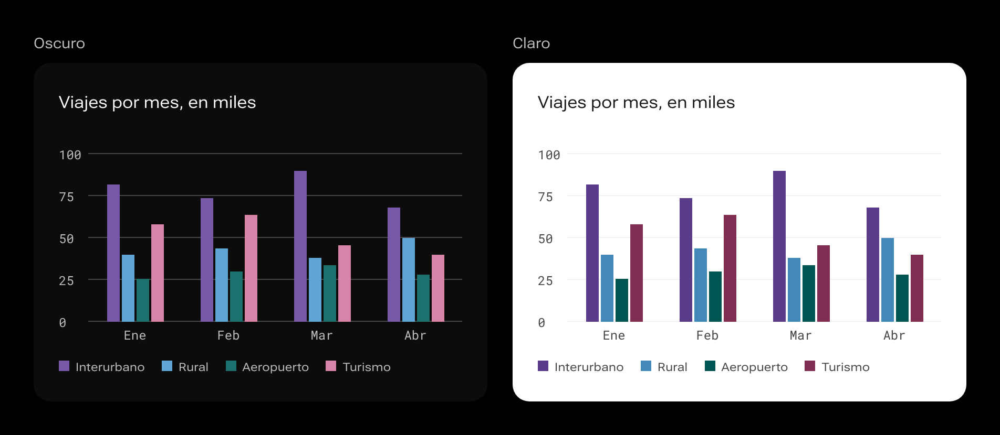

# Color

El color de ALMA: tres capas de tokens, cuatro temas y un solo acento.


## Resumen

### Cómo funciona el color en ALMA

ALMA casi no usa color. La interfaz es un fondo negro, texto claro y un solo acento azul que marca la acción. Todo lo demás, los estados, las etiquetas y los gráficos, usa color solo cuando comunica algo, y siempre con una palabra o un ícono al lado.

Nunca se escribe un color: se pide un **token** por su nombre. El tema decide el valor. Por eso la misma interfaz funciona en los cuatro temas sin cambiar una línea.



### Tres capas

Como en IBM Carbon, los tokens de color van en tres capas. Cada capa apunta a la anterior.

| Capa | Qué nombra | Ejemplos | Se usa en |
|---|---|---|---|
| **Base** | Los colores disponibles: marca y rampas de 50 a 900. | `brand-accent`, `primary-500`, `secondary-700`, `blue-60` | Solo dentro de las otras capas. Nunca directo en una interfaz. |
| **Semántica** | El papel en la interfaz. Cambia con el tema. | `ui-01`, `text-01`, `interactive-01`, `focus`, `support-01` | Pantallas, maquetas y componentes nuevos. |
| **Componente** | Una decisión de un componente, en un estado. | `button-filled-bg-hover`, `field-border-error`, `table-row-bg-selected` | Dentro de cada componente. |

Para ajustar un componente, cambia su token de componente, nunca el semántico: el cambio queda en ese componente y el resto del sistema no se entera.



### Los roles semánticos

| Familia | Tokens | Para qué |
|---|---|---|
| Superficies | `ui-01` a `ui-05` | Capas: la página es `ui-02`; los contenedores, `ui-01`; los paneles anidados, `ui-03` y `ui-04`. `ui-05` es un borde de énfasis. |
| Bordes | `border-subtle`, `border-control` | El borde sutil separa contenedores; el de control marca campos y selectores (3:1). |
| Texto | `text-01` a `text-05`, `text-error`, `text-on-interactive` | Principal, secundario, desactivado, sobre colores. |
| Íconos | `icon-01` a `icon-03` | Principal, secundario, sobre colores. |
| Acción | `interactive-01` a `interactive-04` | Azul para la acción principal; el mismo azul, muy oscuro y apagado, para la secundaria. |
| Estados de interacción | `hover-*`, `active-*`, `selected-ui`, `focus` | Encima, presionado, elegido y foco. |
| Estados del sistema | `support-01` a `support-04` | Error, éxito, advertencia, información. |
| Inversos | `inverse-01`, `inverse-02`, `inverse-support-*` | Superficies que invierten el tema, como el tooltip. |
| Velos | `overlay-01`, `tint-white-*`, `tint-dark-*` | Detrás de modales y sobre imágenes. |
| Pendiente | `pending-bg`, `pending-border`, `pending-text` | Solo en la documentación: marca en magenta lo que falta crear, como una imagen. |

### Capas de superficie

Las superficies se apilan en un orden fijo. Cada capa se distingue de la que tiene debajo, así la jerarquía se lee sin bordes ni sombras.

| Capa | Token | Claro | Oscuro | Qué va ahí |
|---|---|---|---|---|
| 1 | `ui-02` | Gris muy claro | El fondo más profundo | La página. |
| 2 | `ui-01` | Blanco | Blanco al 4 % sobre la página | Contenedores: tarjetas, menús, tablas, alertas. |
| 3 | `ui-03` | Gris claro | Blanco al 7 % | Un panel dentro de un contenedor. |
| 4 | `ui-04` | Gris medio claro | Blanco al 10 % | Una zona dentro de ese panel. |
| Acción | `interactive-01`, `interactive-02` | Azul y azul muy oscuro | Azul y azul muy oscuro | El botón principal, y los acentos profundos. |

No saltes capas hacia atrás: un contenedor dentro de otro `ui-01` pasa a `ui-03`, no vuelve a `ui-02`. En los dos temas cada capa de encima se despega de la anterior.

**Elevación en oscuro.** En el tema oscuro, subir una capa es acercarse a la luz: cada capa mezcla un poco más de blanco sobre la página `#02010C` (4, 7 y 10 %; 6, 12 y 18 % en alto contraste). La mezcla se guarda como un color sólido, no como transparencia. Así las capas anidadas no se suman entre sí, el contraste se puede verificar y el color es el mismo en CSS y en Flutter.

**Texto sobre cualquier capa.** `text-01`, `text-02` y `border-control` cumplen sobre las cuatro capas en los cuatro temas: 4,5:1 para texto y 3:1 para bordes de control, 7:1 para texto en alto contraste. El verificador del repositorio lo prueba en cada cambio.

**Las capas no son bordes.** Para separar un contenedor usa `border-subtle`; para marcar un control, `border-control`. Nunca uses `ui-03` o `ui-04` como borde: en oscuro están demasiado cerca del fondo para verse.



### Cuántos hay

ALMA tiene 495 tokens de color: los de marca, las rampas base, los roles semánticos, 18 colores de gráficos y los de cada componente. Todos están en la pestaña **Tokens** del sitio y en `tokens.json`.

## Uso

### Superficies

Las superficies se separan con color, no con sombra (el modelo de capas de Carbon):

| Capa | Token | Ejemplo |
|---|---|---|
| Página | `ui-02` | El fondo de toda la pantalla. |
| Primera capa | `ui-01` | Tarjetas, menús, tablas, modales. |
| Segunda capa | `ui-03` | Un panel dentro de una tarjeta. |
| Tercera capa | `ui-04` | Una zona dentro de ese panel. |
| Borde | `border-subtle` | Separadores y bordes de contenedores. |

Solo lo que flota sobre el contenido (menús, popovers, tooltips) lleva sombra: `shadow-floating`.



### Un acento

- `interactive-01` (azul) es la acción principal y el foco de la pieza. **Una por pantalla.** Si todo es azul, nada lo es.
- `interactive-02` (el mismo azul, muy oscuro y apagado) es para acentos profundos. El botón neutro (`gray`) es un gris tenue, no este color.
- El texto sobre ambos es siempre `text-on-interactive`.
- En tema oscuro, los bordes, las etiquetas y los controles encendidos usan pasos claros de la rampa azul, que se despegan del negro. En claro usan el azul de acción.

### Texto

| Token | Uso |
|---|---|
| `text-01` | Texto principal y títulos. |
| `text-02` | Texto secundario: ayudas, descripciones, metadatos. |
| `text-03` | Lo que todavía no está: marcadores de posición, pasos por hacer. |
| `text-error` | Mensajes de error. |
| `text-on-interactive` | Texto sobre el azul. |

Son tres niveles con un trabajo cada uno: lo que se vino a leer, lo que ayuda a entenderlo y lo que todavía no está. En un dato, el nombre va en `text-02` y el valor en `text-01`. El detalle está en el patrón **Jerarquía**.

### Estados del sistema

| Estado | Token | Siempre con |
|---|---|---|
| Error | `support-01` | La palabra o el ícono `error`. |
| Éxito | `support-02` | La palabra o el ícono `checkmark--outline`. |
| Advertencia | `support-03` | La palabra o el ícono `warning`. |
| Información | `support-04` | La palabra o el ícono `information`. |

El color nunca es la única pista. Los avisos usan `notification-*-bg` de fondo y `status-icon-*` en el ícono y el borde.

### Etiquetas

`Tag` tiene 11 colores (red, yellow, magenta, purple, blue, cyan, teal, green, warmgray, gray y coolgray), cada uno con su par `tag-<color>-bg` y `tag-<color>-text`. El color agrupa; la palabra informa.

### Gráficos

| Paleta | Tokens | Uso |
|---|---|---|
| Categórica | `viz-cat-01` a `viz-cat-08` | Series distintas, en ese orden: violeta, cian, turquesa, magenta, rojo, un rojo muy claro u oscuro según el tema, verde y azul. Con más de 8, agrupa. |
| Secuencial | `viz-seq-1` a `viz-seq-5` | Valores de menos a más. |
| Divergente | `viz-div-1` a `viz-div-5` | Desvíos alrededor de un centro neutro (`viz-div-3`). |

Cada color categórico llega a 3:1 sobre `ui-01` en su tema. Rotula las series o usa forma o trama: el color solo no basta.



### Contraste

| Qué | Mínimo en Oscuro y Claro | Mínimo en alto contraste |
|---|---|---|
| Texto normal | 4,5:1 | 7:1 |
| Texto grande (24 px, o 19 px en negrita) | 3:1 | 4,5:1 |
| Bordes de controles, foco e íconos que informan | 3:1 | 3:1 |

`npm test` revisa 580 pares de color en los cuatro temas antes de cada cambio.

### No

- No escribas un hex en una interfaz: pide el token.
- No uses una rampa base (`primary-500`) donde hay un rol semántico (`interactive-01`).
- No uses el azul de acción para decorar.
- No diferencies dos estados solo por el color.

## Código

### CSS

Carga `alma.css` (en `dist/css/`). Define cada token como variable CSS y los cuatro temas:

```css
.aviso { background: var(--ui-01); color: var(--text-01); border: 1px solid var(--border-subtle); }
.aviso:focus-visible { outline: 2px solid var(--focus); outline-offset: 2px; }
```

El tema lo elige el atributo `data-theme` de un contenedor, normalmente `<html>`: `dark` (por defecto), `light`, `dark-hc` o `light-hc`. Ver la página **Temas**.

### JavaScript

`dist/js/tokens.mjs` exporta los valores ya resueltos por tema:

```js
import { themes } from './dist/js/tokens.mjs';
themes.dark['interactive-01'];   // '#2667F2'
themes.light['interactive-01'];  // el valor del tema claro
```

Úsalo donde no llegan las variables CSS, como un gráfico en canvas.

### Flutter

`dist/dart/alma_tokens.dart` trae `AlmaColors`, una `ThemeExtension` con un campo por token, en camelCase, y los cuatro temas:

```dart
MaterialApp(theme: ThemeData(extensions: const [AlmaColors.dark]));
final c = Theme.of(context).extension<AlmaColors>()!;
Container(color: c.ui01, child: Text('Hola', style: TextStyle(color: c.text01)));
```

Los temas son `AlmaColors.dark`, `.light`, `.darkHc` y `.lightHc`.

### Cambiar un color

Los tokens viven en `tokens/` del repositorio, en formato W3C. Se cambian ahí, nunca en `dist/`:

1. Edita el valor en `tokens/themes/<tema>.json` o en `tokens/core/`.
2. `npm run build` genera CSS, JS, Dart y el `tokens.json` del artefacto.
3. `npm test` comprueba la ida y vuelta y el contraste de los 580 pares.

## Matriz

### La idea

Un token de color no guarda un color elegido a mano: ocupa un **casillero**, que es una familia y un paso. `interactive-01` es «Primary 500», `link-01` es «Tertiary 500», `text-02` es «Secondary 800». Si cambian las rampas, todo se recolorea solo y sigue combinando.

La tabla completa está en `tokens/matriz.json`. Gobierna los temas claro y oscuro de ALMA y de todas las entidades.

### Las tres familias

| Familia | Qué es | Qué cuelga de ella |
|---|---|---|
| **Primary** | La marca. | Solo el botón principal y sus estados. |
| **Tertiary** | La acción. | Enlaces, foco, lo elegido, controles encendidos, el texto de los botones tenue y plano. |
| **Secondary** | El neutro. | Fondos, textos, bordes, lo desactivado. |

- **La marca aparece como relleno en un solo lugar.** Por eso se reconoce.
- **La acción es siempre un azul de enlace.** En una marca que ya es ese azul (ALMA, Autómata, ORCA), Tertiary y Primary son la misma rampa. En una marca de otro color (Cordura, Ensayo), el color de la marca queda en el botón principal y los enlaces siguen azules.
- **El neutro lleva un rastro del tono de la acción,** un 5 %. Los textos y los enlaces se sienten de una misma familia.

Las etiquetas, los estados y las notificaciones toman su casillero de la rampa de su color: una etiqueta lleva el fondo en el 200 y el texto en el 700; un estado va en el 500 en claro y en el 400 en oscuro.

### La luz ordena las capas

Más luz es más cerca y más importante, en los dos temas.

| Capa | Claro | Oscuro |
|---|---|---|
| Página (`ui-02`) | Secondary 50 | Negro |
| Contenedor (`ui-01`) | Blanco | Secondary 1000 |
| Panel dentro (`ui-03`) | Secondary 100 | Secondary 950 |

Un contenedor más claro que su fondo se despega solo, sin borde. En claro la regla tiene un techo, el blanco: lo que va dentro de un contenedor blanco se distingue con el tinte de la acción, no con más luz.

### Lo que responde

- **En claro, lo que responde se tiñe de acción:** una fila con el cursor, una fila elegida y un campo van en los pasos más claros de Tertiary.
- **En oscuro son neutras.** Un azul saturado sobre negro pesa lo mismo que un botón; el color se reserva para lo que se presiona, se escribe o se marca.

### Cómo se cambia

1. Edita un casillero en `tokens/matriz.json`.
2. Corre `npm run matriz:aplicar` y después `npm run build`.
3. Corre `npm test`: comprueba que cada par de texto y fondo alcance su contraste, en ALMA y en todas las entidades.

`npm run matriz` arma una página con la matriz completa, sistema por sistema.

### Alto contraste

Los dos temas de alto contraste tienen sus propios casilleros. Parten de la misma matriz y empujan cada cosa hacia el extremo de su rampa:

| Qué | Claro | Claro, alto contraste | Oscuro | Oscuro, alto contraste |
|---|---|---|---|---|
| Texto principal | Secondary 900 | Negro | Secondary 50 | Secondary 50 |
| Texto secundario | Secondary 800 | Secondary 950 | Secondary 300 | Secondary 200 |
| Botón principal | Primary 500 | Primary 900 | Primary 500 | Primary 200 |
| Enlace | Tertiary 500 | Tertiary 900 | Tertiary 400 | Tertiary 50 |
| Borde de un control | Secondary 600 | Secondary 800 | Secondary 600 | Secondary 400 |

- **El texto tiene que alcanzar 7 a 1,** no 4,5.
- **La marca se mueve por su propia rampa:** en claro baja al paso más oscuro y en oscuro sube a uno claro, para leerse contra la página. El texto del botón es blanco o negro, el que se lea.
- **Las capas siguen la misma regla de la luz:** página teñida y contenedor blanco en claro; página negra y capas que suben en oscuro.

### Los gráficos

Los colores de los gráficos también tienen casillero.

| Serie | De dónde sale | Regla |
|---|---|---|
| **Categórica** (`viz-cat-01` a `08`) | Ocho rampas de color: púrpura, cian, verde azulado, magenta, rojo, verde y azul. | Un paso oscuro en claro y uno claro en oscuro. Cada una alcanza 3 a 1 sobre un contenedor. |
| **De un solo tono** (`viz-seq-1` a `5`) | Primary, la marca. | Cinco pasos de la rampa. El valor más alto es el más oscuro en claro y el más claro en oscuro. |
| **Divergente** (`viz-div-1` a `5`) | Rojo de error a un lado, Primary al otro y el neutro al centro. | Igual en los cuatro temas. |

En una entidad, la serie de un solo tono toma su marca. La categórica es la misma en todas: sirve para distinguir, no para identificar.
