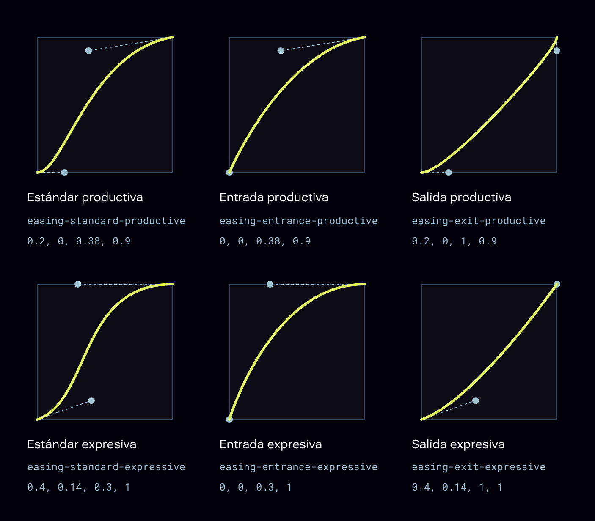
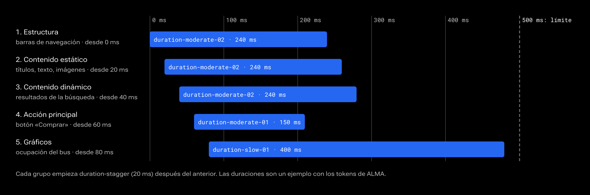

# Movimiento

El movimiento explica qué cambió. Productivo en la interfaz, expresivo en los momentos de marca.


## Resumen

### Por qué se mueve algo

Cordura es un estudio de lenguajes de movimiento, y ALMA usa el lenguaje de movimiento de IBM (IBM Design Language, Carbon). El movimiento explica qué cambió, de dónde vino algo y a dónde fue. Nunca decora.

### Dos estilos

| Estilo | Tokens | Cuándo |
|---|---|---|
| **Productivo** | `easing-*-productive` | La interfaz de trabajo. Eficiente, no distrae. Es el de los componentes. |
| **Expresivo** | `easing-*-expressive` | Momentos importantes: abrir una página nueva, la acción principal, alertas, un pago aprobado. Con moderación. |

### Curva según la intención

| Curva | Para lo que |
|---|---|
| `standard` | Se mueve dentro de la pantalla. |
| `entrance` | Aparece: desacelera al llegar. |
| `exit` | Se va: acelera al salir. |



### Duración según el tamaño y la distancia

| Token | Valor | Para |
|---|---|---|
| `duration-fast-01` | 70 ms | Botones y toggles. |
| `duration-fast-02` | 110 ms | Tooltips, bordes de campo, menús. |
| `duration-moderate-01` | 150 ms | Cambios cortos. Por defecto. |
| `duration-moderate-02` | 240 ms | Expansiones, toasts, modales. |
| `duration-slow-01` | 400 ms | Expansiones grandes. |
| `duration-slow-02` | 700 ms | Velos y portadas. |

### Recetas de IBM

| Receta | Duración y curva | En ALMA |
|---|---|---|
| Revelar | `duration-moderate-01` + `easing-entrance-productive` | Sidebar. El contenido del Accordion usa la misma curva con `duration-moderate-02`. |
| Contextual | `duration-fast-02` + `easing-entrance-expressive` | Menús, tooltips, popovers. |
| Expandir | `duration-moderate-02` + `easing-standard-productive` | Paneles que crecen en su lugar. |
| Invocar | `duration-moderate-02` + `easing-standard-expressive` | Modal y Alert. |

### Movimiento reducido

Si la persona lo pide en su sistema, **toda** animación de ALMA se vuelve instantánea. No hay excepciones: `bundle.css` lo aplica a todo el sistema. El movimiento nunca es la única forma de comunicar algo.

## Coreografía

### Cuando entran varios elementos

Si una pantalla nueva trae varios elementos, no los animes todos a la vez ni uno por uno. Repártelos por grupos, con `duration-stagger` (20 ms) entre cada uno, y con el total bajo 500 ms.

| Orden | Qué entra |
|---|---|
| 1 | La estructura: barras de navegación. |
| 2 | El contenido estático: títulos, texto, imágenes. |
| 3 | El contenido dinámico: datos de una tabla, resultados. |
| 4 | La acción principal. |
| 5 | Los gráficos animados. |



### Principios de IBM Carbon

- **Expresivo solo en lo importante.** El resto es productivo.
- **Sobre la grilla.** Nada se mueve en diagonal.
- **Lo que significa lo mismo se mueve igual.** Desplegar una fila y abrir un menú usan la misma curva; la duración cambia con el tamaño.
- **La dirección tiene sentido.** Avanzar en la dirección de entrada afirma; volver sobre ella cancela.
- **Continuidad.** Los elementos compartidos entre pantallas (títulos, botones) hacen de puente en la transición.
- **Las salidas son más cortas que las entradas.**

### Principios de Apple

- **Con propósito.** Acompaña la experiencia, no la tapa.
- **Opcional.** Nunca es la única forma de comunicar algo importante.
- **Realista.** Sigue el gesto y la expectativa: lo que baja para abrirse sube para cerrarse.
- **Breve y preciso** en la respuesta a una acción, sin animaciones propias en interacciones frecuentes.
- **Interrumpible.** Nadie espera a que termine una animación para seguir.

### Movimiento de marca

El movimiento de marca es el expresivo: vive en las portadas y en la firma, nunca en la interfaz. Son seis recetas, y todas cuentan lo mismo: algo disperso toma forma. Cada entidad las usa con sus propios valores, sobre los mismos tokens.

| Receta | Qué hace | Tiempo |
|---|---|---|
| Escribirse | El nombre de la entidad se escribe letra por letra. Cada letra llega en el peso más liviano (100) y fuera de foco, y sube hasta `font-weight-display`. | Cada letra se enfoca en `duration-slow-02` y toma su peso en 1,75 veces eso. Entre letras pasan los números de la entidad, contados en pulsos de dos `duration-stagger`. |
| Armarse | Lo que se muestra llega como polvo y se asienta. Una sola vez, al entrar. | Dos `duration-slow-02` en un recorrido o en un planeta; dos y media en una portada con objeto. |
| Deshacerse | Bajo una línea de la pantalla, lo cercano se suelta en granos que flotan, cada uno a su tiempo. Al retroceder se vuelve a armar. | Sigue al desplazamiento: no tiene duración propia. |
| Responder | Al acercar el puntero, las letras ganan uno o dos pasos de peso. Con teclado, las flechas hacen lo mismo. | Sigue al puntero con suavidad; al soltarlo vuelve sola. |
| Avanzar | La página avanza con quien la lee: el desplazamiento mueve la cámara. | Sigue al desplazamiento. Si la persona se detiene, todo se detiene. |
| Descansar | Fuera de la pantalla, nada se mueve. | Inmediato. |

Los tiempos salen de los tokens tal como los tiene cada entidad. Una entidad que se mueve un 25 % más lento también se escribe y se arma un 25 % más lento, sin tocar nada más.

- **Se nota, no se grita.** Una respuesta al puntero cambia uno o dos pasos, nunca de un extremo a otro.
- **Una vez.** Una entrada ocurre al llegar y no se repite sola.
- **Quien lee marca el paso.** Lo que depende del desplazamiento no corre por su cuenta.
- **Con movimiento reducido,** todo aparece armado y escrito desde el principio, y no hay granos ni giro.

#### La partitura

Las seis recetas están escritas una sola vez, en `site/partitura.js`, y de ahí las toma cada pieza: la palabra, las portadas y los planetas piden sus tiempos en vez de calcularlos. Lo que dice esta página y lo que hace una página publicada es lo mismo.

Una secuencia también se escribe como partitura: una lista de pasos, cada uno con cuándo empieza, cuánto dura y con qué curva. Los tiempos se dan en tokens, no en milisegundos.

| Parte | Cómo se escribe | Ejemplo |
|---|---|---|
| Cuándo empieza | Un token y cuántas veces, o «sigue» para empezar cuando termina el paso anterior. | `['duration-slow-02', 1]` |
| Cuánto dura | Un token y cuántas veces. | `['duration-slow-01', 1]` |
| Con qué curva | El nombre de un token de curva. | `easing-entrance-expressive` |

- **Una vez.** Una partitura se toca al llegar y no se repite sola.
- **Con movimiento reducido,** una partitura está en su final desde el principio.
- **Un solo reloj.** Todas las piezas de una página se mueven con el mismo, `site/reloj.js`: si una se detiene, las demás siguen.

La llegada a un planeta es una partitura: la palabra se escribe y el suelo se asienta; lo que se dice aparece cuando las primeras letras ya están en foco, y los controles un poco después.

#### Medida contenida

Una entidad puede pedir la medida contenida cuando su lenguaje dice que lo que está en pantalla se queda donde está. Entonces nada llega volando, el puntero no revuelve nada, los granos no flotan y la mirada gira menos de la mitad. Se escribe con `"medida": "contenida"` en el contenido de su portada. Hoy la usa Autómata.

Una portada contenida puede pedir, aun así, que el puntero revuelva la figura, con `"agita": true`. Lo demás sigue contenido. La portada de Autómata con busto lo pide: sus puntos se apartan al paso del puntero, como el suelo de su planeta.

La palabra como pieza está en `site/palabra.js` y se trabaja en la página Palabra (`npm run palabra`).

## Código

### CSS

```css
.panel { transition: transform var(--duration-moderate-02) var(--easing-standard-productive); }
.menu { animation: aparecer var(--duration-fast-02) var(--easing-entrance-expressive) both; }
@keyframes aparecer { from { opacity: 0; transform: translateY(-4px); } }
```

### Movimiento reducido

Los componentes de ALMA ya lo respetan. En tus propias animaciones, agrégalo:

```css
@media (prefers-reduced-motion: reduce) {
  .panel, .menu { transition-duration: 1ms; animation-duration: 1ms; }
}
```

### Escalonar

```css
.resultado { animation: aparecer var(--duration-moderate-01) var(--easing-entrance-productive) both;
             animation-delay: calc(var(--i) * var(--duration-stagger)); }
```

Cada elemento lleva su índice en `--i` (0, 1, 2…). Cuida que el último termine antes de 500 ms.

### Flutter

```dart
AnimatedContainer(duration: AlmaDuration.moderate02, curve: AlmaEasing.standardProductive, …);
```

`AlmaDuration` trae `fast01` a `slow02` y `stagger`; `AlmaEasing`, las seis curvas como `Cubic`. Respeta `MediaQuery.disableAnimationsOf(context)`.
