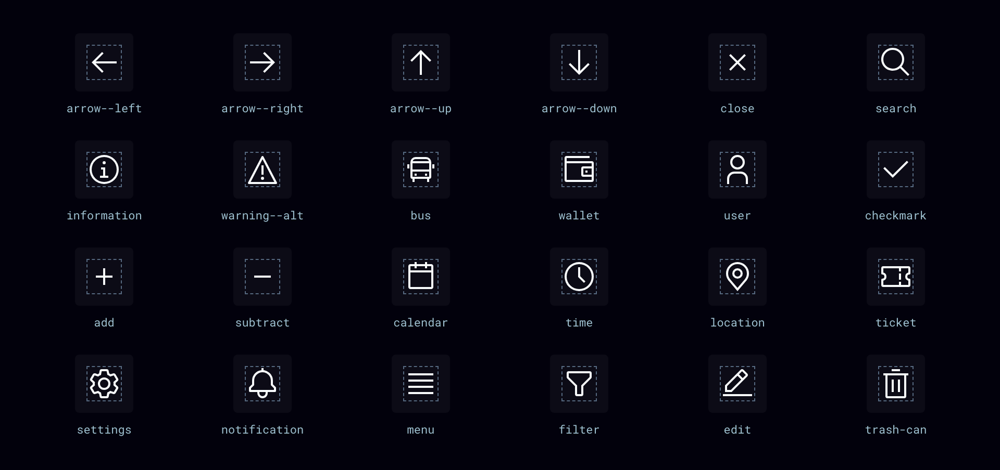

# Íconos

Íconos de IBM Carbon, dibujados como SVG dentro de la página.


## Resumen

### La biblioteca

ALMA usa los íconos de **IBM Carbon** (`@carbon/icons` 11.89, licencia Apache 2.0), dibujados como SVG dentro de la página: no hay fuentes que descargar, se ven desde el primer instante y heredan el color del texto.

- ALMA incluye **896 íconos de interfaz**: acciones, navegación, estados, personas, comercio y viajes.
- El catálogo completo, con **2.775 íconos**, sus categorías y sinónimos, está en `assets/Icons/carbon-icons.json`. Se carga solo cuando hace falta.
- Reemplazan a Material Symbols desde el 29 de septiembre de 2026: las tres fuentes de Material pesaban 12,6 MB por página y dejaban los íconos invisibles hasta cargar.



### Tamaños

| Token | Tamaño | Uso |
|---|---|---|
| `icon-size-sm` | 16 px | Dentro de datos densos: tablas, etiquetas, contadores. |
| `icon-size-md` | 20 px | Dentro de controles: menús, campos de búsqueda, selectores. |
| `icon-size-lg` | 24 px | Por defecto. |
| `icon-size-xl` | 32 px | En zonas vacías y estados vacíos. |

Van en `rem`: crecen con el texto.

### Estilo

- Un solo peso y un solo estilo, dibujados en una grilla de 32 px y escalados.
- Contorno por defecto. La versión rellena (`filled`) se usa para lo elegido (el destino actual de la navegación) y en avisos.
- Sin emoji, y sin mezclar otros sets.

## Uso

### Cuándo un ícono

- Para reconocer una acción o un destino más rápido: cerrar, buscar, volver.
- Junto a un texto, para reforzarlo.
- Solo, en botones de uso muy frecuente y conocido; entonces necesita un nombre (`aria-label`) y conviene un `Tooltip`.

### Cuándo no

- Para decorar.
- Si el ícono no es conocido: una palabra se entiende antes.
- Para distinguir estados solo por el ícono: acompáñalo de la palabra.

### Color

El ícono hereda el color de su texto (`currentColor`). Ponlo dentro de algo que ya use:

| Token | Uso |
|---|---|
| `icon-01` | Íconos principales. |
| `icon-02` | Íconos secundarios, como los de una lista. |
| `text-on-interactive` | Sobre lima o acero. |
| `status-icon-*` | En avisos de error, éxito, advertencia e información. |

Un ícono que informa necesita 3:1 contra su fondo.

### Íconos frecuentes

| Acción | Ícono |
|---|---|
| Cerrar | `close` |
| Volver / avanzar | `arrow--left` / `arrow--right` |
| Buscar | `search` |
| Más acciones | `overflow-menu--horizontal` |
| Desplegar | `chevron--down` |
| Ir al detalle | `chevron--right` |
| Información / error / advertencia | `information` / `error` / `warning` |
| Éxito | `checkmark--outline` |

### Alineación

- Centrado en la altura de su línea de texto.
- Entre ícono y texto, `space-8` (en controles pequeños) o `space-16` (en filas de lista y navegación).

## Código

### Componente `Icon`

```js
const { Icon } = window.AlmaDS;
h(Icon, { name: 'arrow--right' })                       // decorativo: oculto para lectores
h(Icon, { name: 'warning', variant: 'filled', size: 20, label: 'Advertencia' })
```

| Propiedad | Tipo | Por defecto | Uso |
|---|---|---|---|
| `name` | `string` | — | Nombre de Carbon, como `arrow--right`. |
| `variant` | `'outlined' \| 'filled'` | `'outlined'` | `filled` usa la versión `--filled` si existe. |
| `size` | `16 \| 20 \| 24 \| 32` | `24` | En px; se dibuja en rem. |
| `label` | `string` | — | Nombre para el lector. Sin él, el ícono es decorativo. |

### Íconos fuera del set incluido

Carga el catálogo completo una vez y usa cualquier nombre:

```js
fetch('assets/Icons/carbon-icons.json').then(r => r.json()).then(AlmaDS.registerIcons);
AlmaDS.iconNames();   // los nombres disponibles
```

`registerIcons` solo acepta formas SVG simples y rechaza cualquier otra cosa.

### Nombres anteriores

Los nombres de Material Symbols que usaban los componentes (`arrow_forward`, `content_copy`…) siguen funcionando durante la transición, con un aviso en la consola que dice el nombre de Carbon. Cámbialos.
