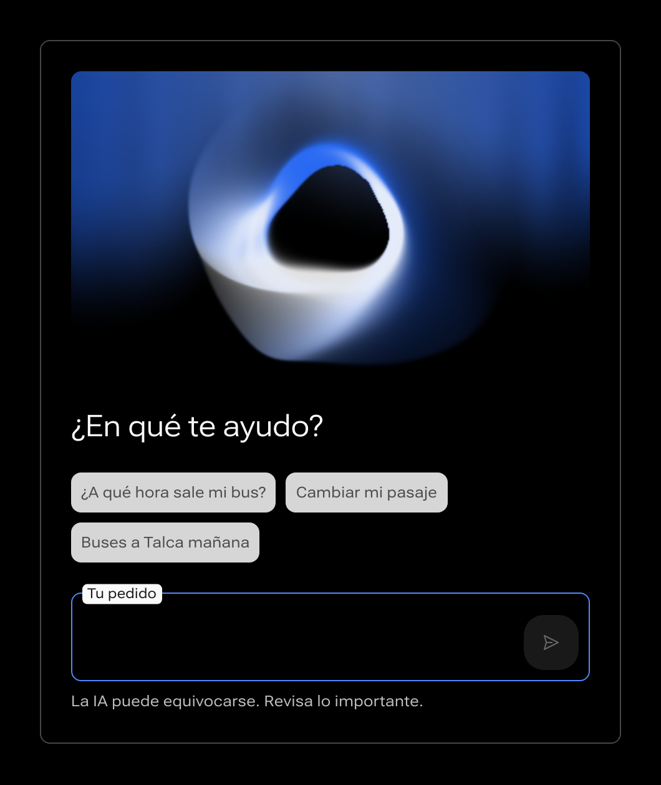
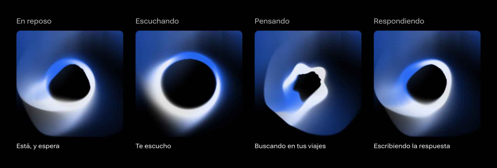
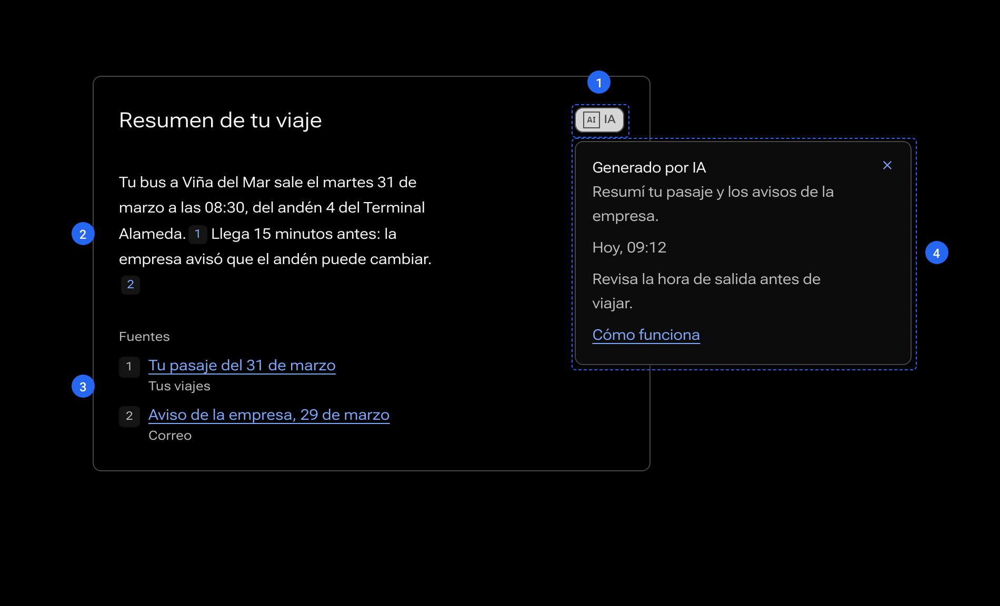

# Interfaces de IA

Cómo se muestra una IA en ALMA: su presencia, lo que genera, sus estados y el control que conserva la persona.


## Resumen

### Para qué

Una IA responde distinto cada vez, a veces se equivoca y puede actuar por su cuenta. Nada de eso pasa con un botón. Esta guía dice cómo mostrarlo para que la persona sepa siempre tres cosas: **qué hizo la IA, qué tan seguro es y cómo deshacerlo**.

Vale para toda función que genere, resuma, recomiende, converse o actúe con un modelo. No importa qué modelo sea ni quién lo provea.

### Cuándo usar IA

| Úsala cuando | No la uses cuando |
|---|---|
| La tarea es abierta: redactar, resumir, buscar con palabras propias. | Hay una respuesta exacta que un cálculo o una regla entregan. |
| Un error se nota y se corrige fácil. | Un error cuesta plata, salud o un derecho, y nadie lo revisa. |
| Ahorra un trabajo que la persona no quiere hacer. | Quita una decisión que la persona quiere tomar. |
| El resultado mejora con contexto de la persona. | El mismo resultado sirve igual para todos: muéstralo y ya. |

Si un filtro, una plantilla o un buen valor inicial resuelven lo mismo, úsalos. Son más rápidos, siempre dan lo mismo y no hay que explicarlos.

### Tres maneras de aparecer

| Manera | Qué hace | Ejemplo | Lo que más importa |
|---|---|---|---|
| **Asistida** | Propone algo dentro de una tarea que la persona ya hace. | Un resumen del viaje, un borrador de mensaje. | Marcar lo generado y dejar editar. |
| **Conversada** | Un asistente al que se le pide con palabras. | «¿A qué hora sale el último bus a Talca?» | Estados claros, fuentes y poder detener. |
| **Delegada** | Un agente que hace varios pasos por la persona. | Cambiar un pasaje y avisar a quien viaja contigo. | Mostrar el plan, pedir permiso y poder deshacer. |

Empieza por la asistida. Cada paso hacia la derecha pide más confianza, y más de esta guía.

### Principios

1. **Se sabe que es una IA.** Lo que una IA genera lleva su marca. Nunca se hace pasar por una persona.
2. **La persona decide.** La IA propone; aceptar, editar o descartar es de la persona. Lo que no se puede deshacer pide permiso antes.
3. **Dice lo que sabe y lo que no.** Muestra de dónde sacó la respuesta. Cuando duda, lo dice con palabras.
4. **Se equivoca bien.** Un error se puede ver, corregir y reportar. La pantalla sigue sirviendo sin la IA.
5. **Se puede detener.** Toda respuesta en curso y toda tarea de un agente tienen cómo pararse, a un toque.
6. **Presente, no protagonista.** La IA se nota donde está, y nada más. El contenido de la persona va primero.
7. **Los datos son de la persona.** Se dice qué se usa, se pide permiso y se puede borrar.
8. **Es para todos.** Lo mismo con teclado, con lector de pantalla y con movimiento reducido.

### Cómo se ve

La IA no tiene color propio en ALMA. Usa el acento de cada entidad, como todo lo demás. Lo que la distingue es **la luz**: el Velo y el Halo, dos efectos de ALMA, juntos. El Velo es el aire; el Halo, algo que late dentro. Es lo que ya cierra las portadas con busto.

Esa luz es para los momentos en que la IA es el tema: cuando se presenta, escucha o piensa. En el resto de la interfaz basta la **marca de IA**, un ícono y dos letras.

La pestaña Presencia lo detalla.

### Qué trae esta guía

| Pestaña | Responde |
|---|---|
| Presencia | Cuándo y cómo se usan el Velo y el Halo, y qué dice el Halo en cada estado. |
| Transparencia | Cómo se marca lo generado, cómo se explica y cómo se muestran las fuentes y la duda. |
| Conversación | Las partes de un asistente: el pedido, la respuesta y sus acciones. |
| Estados | Todo lo que puede pasar entre pedir y recibir, y qué se muestra en cada caso. |
| Control | Aceptar, editar, deshacer; permisos de un agente; datos y memoria. |

Dos partes viven en su propia guía, junto a lo demás de su tema: **Contenido › IA** dice cómo habla una IA en ALMA, y **Accesibilidad › IA**, cómo se usa con lector de pantalla, con teclado y con movimiento reducido.

### Con qué se arma

| Pieza | Qué es | Dónde está |
|---|---|---|
| `AILabel` | La marca de IA, con su explicación. | Componentes › IA |
| `PromptInput` | La caja de pedido, con enviar y detener. | Componentes › IA |
| `ChatMessage` | Un turno de la conversación, con sus estados. | Componentes › IA |
| `SourceList` | La lista de fuentes, y `SourceRef`, el número junto a la frase. | Componentes › IA |
| `AlmaEfectos.presencia` | El Velo y el Halo juntos, con los estados del Halo. | Efectos |

Lo demás es ALMA de siempre: `Button`, `Tag`, `Sheet`, `InlineNotification`, `ToastRegion` y los patrones Deshacer, Diálogos y Carga.

### De dónde viene

La base son nuestros referentes. De IBM Carbon vienen la marca de IA, la explicación por niveles y la idea de una presencia propia. De Apple, el control de la persona, corregir fácil y decir los límites. De Google, enseñar qué puede y qué no puede hacer la IA, y fallar con gracia. De Meta, marcar las imágenes y los medios generados. La luz como presencia es de ALMA.

### Código

#### La presencia

```html
<div class="ia-escenario" aria-hidden="true"></div>
<h1>¿En qué te ayudo?</h1>
<p role="status">Buscando en tus viajes</p>
```

```css
.ia-escenario { height: 15rem; border-radius: var(--radius-panel); overflow: hidden; }
```

```js
var luz = AlmaEfectos.presencia(document.querySelector('.ia-escenario'), 'reposo');

if (luz) luz.estado('pensando');   // reposo, escuchando, pensando, respondiendo, apagada
```

`presencia` monta el Halo sobre el Velo y lleva cada ajuste del Halo a su nuevo valor con el tiempo y la curva de ALMA. Devuelve `null` si el equipo no tiene WebGL: por eso el `if`, y por eso el estado va siempre escrito aparte. Con `luz.quita()` se retira.

#### La marca de IA

```js
h(AILabel, {
  what: 'Resumí tu pasaje y los avisos de la empresa.',
  when: 'Hoy, 09:12',
  review: 'Revisa la hora de salida antes de viajar.'
})
```

#### Una conversación

```js
h('ol', { className: 'conversacion' },
  h(ChatMessage, { as: 'li', from: 'user' }, '¿A qué hora sale mi bus?'),
  h(ChatMessage, { as: 'li', status: estado, statusText: 'Buscando en tus viajes',
    sources: fuentes, onRetry: repetir, feedback: voto, onFeedback: setVoto },
    texto ? h('p', null, texto) : null)),

h(PromptInput, { placeholder: 'Pregunta por tus viajes', busy: enCurso, onSubmit: enviar, onStop: detener })
```

El mismo `ChatMessage` pasa de `thinking` a `writing` y a `done`: así se anuncia una sola vez, completo. El detalle de cada pieza está en su página, en Componentes › IA.

## Presencia

### La esencia: Velo y Halo

Una IA no tiene cara, y en ALMA no se le inventa una. No hay robot, ni avatar, ni chispas. Lo que hay es luz que se mueve.

- **El Velo** es el aire: cortinas de luz que cuelgan y se mecen. Dice «aquí hay algo».
- **El Halo** es lo que vive dentro: un anillo que respira, late y deja estela. Dice «y está despierto».

Juntos, el Velo detrás y el Halo delante, son la presencia de una IA. Los dos toman el acento y el color de texto de la entidad, así que cada entidad tiene su propia luz sin que nadie la dibuje.



### Tres niveles

La presencia tiene tres tamaños. Se elige el menor que alcance.

| Nivel | Qué lleva | Dónde | Cuántas |
|---|---|---|---|
| **Escenario** | Velo y Halo, en una zona completa. | La portada de una IA, la bienvenida de un asistente, una conversación vacía, el modo de voz. | Una por pantalla. |
| **Figura** | Solo el Halo, pequeño, sobre el fondo de la página. Desde 96 px de lado. | La cabecera de un panel de asistente, el estado de una tarea larga. | Una por pantalla. |
| **Marca** | El ícono `ai-label` y el texto «IA». Sin luz. | Junto a todo lo que una IA generó. | Las que hagan falta. |

Una pantalla tiene **una sola luz**. Si ya hay un escenario, no hay figura. Si hay diez resúmenes generados, hay diez marcas y ninguna luz.

### Dónde va y dónde no

| Sí | No |
|---|---|
| En una zona propia, sin texto encima. | Detrás de un texto, un formulario o una tabla. |
| Cuando la IA es el tema del momento. | En cada tarjeta que tenga algo generado. |
| Al abrir: se ve al entrar y deja paso al contenido. | Fija y brillando mientras la persona lee o escribe. |
| Con los colores de la entidad. | Con un color «de IA» aparte, morado o arcoíris. |
| En un botón: nunca. Un botón de IA es un `Button` con el ícono `ai-generate`. | Como borde brillante de un campo o de un botón. |

La regla de las portadas vale aquí igual: **un fondo y un texto nunca se encuentran**. El saludo, las sugerencias y la caja de pedido van debajo de la luz, sobre fondo liso. Así el contraste del texto no depende de dónde cayó un pliegue del Velo.

Cuando empieza la conversación, el escenario se va: se desvanece con `duration-slow-01` y la primera respuesta ocupa su lugar. Desde ahí, si hace falta decir que la IA trabaja, lo dice la figura o el indicador de estado.

### El Halo dice el estado

El Halo cambia con lo que la IA está haciendo. No hace falta leer para saber si escucha o piensa, pero el estado **siempre va también escrito**: el Halo acompaña, no informa solo.



| Estado | Qué transmite | Tamaño | Pulso | Pétalos | Estela | Giro | Velocidad | Latido |
|---|---|---|---|---|---|---|---|---|
| **En reposo** | Está, y espera. | 1,2 | 2 | 3 | 0,8 | 1 | 1 | 0,6 |
| **Escuchando** | Atiende. Se abre y se aquieta. | 1,5 | 0,6 | 3 | 0,6 | 0,4 | 0,5 | 0 |
| **Pensando** | Trabaja. Se recoge y gira. | 0,9 | 3 | 5 | 0,9 | 2,2 | 1,8 | 0 |
| **Respondiendo** | Habla. Parejo, con un latido suave. | 1,2 | 1,2 | 3 | 0,8 | 1 | 1,2 | 0,3 |
| **Sin servicio** | No está. | Sin Halo. Queda el Velo, con la fuerza en 0,3. | | | | | | |

Estos valores vienen puestos en `AlmaEfectos.presencia`, que monta el Velo y el Halo juntos y cambia de estado con `estado('pensando')`. En reposo son los mismos valores de la portada de Autómata. El paso de un estado a otro no salta: cada ajuste se mueve hacia su nuevo valor durante `duration-slow-02`.

Un error no se dice con el Halo ni con color rojo en la luz. Se dice con un mensaje. La luz solo se apaga.

### El Velo

El Velo no cambia con el estado. Sus valores son los de la portada: caída 0,45, amplitud 1, suavidad 0,35, fuerza 0,7 y velocidad 1.

En un escenario de menos de 240 px de alto, baja la caída a 0,35 para que el Halo no quede tapado.

### Entrada y salida

| Momento | Qué pasa | Tiempo |
|---|---|---|
| Entra el escenario | Primero el Velo, después el Halo. | `duration-slow-02` cada uno, con `easing-entrance-expressive`. |
| Cambia el estado | Los ajustes del Halo se mueven a sus nuevos valores. | `duration-slow-02`. |
| Sale el escenario | Los dos juntos se desvanecen. | `duration-slow-01`, con `easing-exit-expressive`. |

### Movimiento reducido

Con movimiento reducido, el Velo y el Halo son un cuadro quieto: la misma luz, sin moverse. El Halo no late ni cambia con el estado. Por eso el estado va siempre escrito.

### Cuando no hay luz

Los dos efectos se dibujan con WebGL. Si el equipo no lo tiene, no se dibuja nada y la zona queda con el fondo de la página. La pantalla tiene que servir igual: por eso nada de lo que importa está en la luz.

Trabajan solo mientras están a la vista y con la pestaña al frente. Fuera de eso no gastan.

### Lista de comprobación

- Hay una sola luz en la pantalla.
- No hay texto ni controles encima de ella.
- El estado está escrito, además de verse.
- La luz usa los colores de la entidad, por token.
- Con movimiento reducido se ve un cuadro quieto y nada se pierde.
- Sin WebGL, la pantalla se entiende igual.

## Transparencia

### La marca de IA

Todo lo que una IA generó lleva una marca: el ícono `ai-label` y el texto «IA». Es pequeña, neutra y siempre la misma. No es un adorno ni un sello de calidad: dice de dónde viene lo que estás leyendo.

Es el componente `AILabel`. Se puede abrir: al tocarla, explica.



1. **Marca.** Junto al título de lo generado, o en su esquina superior derecha.
2. **Contenido generado.** Con el mismo estilo de texto que el resto. No va en cursiva ni en otro color.
3. **Fuentes.** De dónde salió cada afirmación.
4. **Explicación.** Lo que la marca muestra al abrirse.

### Dónde va la marca

La marca va en el contenedor más chico que encierre todo lo generado. Una sola por contenedor.

| Lo generado es | La marca va | Ejemplo |
|---|---|---|
| Toda la página | En el encabezado, junto al título. | Un informe armado por la IA. |
| Una sección o tarjeta | Junto al título de la sección. | «Resumen de tu viaje». |
| Un mensaje de una conversación | No hace falta en cada mensaje: basta el nombre del asistente y el aviso bajo la caja. | Una respuesta del asistente. |
| El valor de un campo | Dentro del campo, al final, mientras nadie lo edite. | Una dirección completada sola. |
| Una fila o una celda | En la celda, o en una columna propia si son muchas. | Una categoría sugerida para un gasto. |
| Una imagen, un audio o un video | Sobre la esquina inferior izquierda, siempre a la vista. Y en sus datos. | Una ilustración generada. |
| Una sugerencia que aún no se acepta | En la sugerencia, junto a sus acciones. | Un borrador de respuesta. |

Si la persona edita lo generado, deja de ser solo de la IA. La marca cambia a «IA · editado» y aparece cómo volver a la versión original. Si lo reescribe entero, la marca se va.

### Qué explica

La explicación tiene tres niveles. Cada uno alcanza para quien se queda ahí.

| Nivel | Dónde | Qué dice | Largo |
|---|---|---|---|
| **1. Qué es** | La marca misma. | «IA»: esto lo generó una IA. | Dos letras. |
| **2. Cómo se hizo** | El `Popover` de la marca. | Qué hizo, con qué datos y cuándo. Qué tan seguro es, si se sabe. | Hasta cuatro líneas. |
| **3. El detalle** | Una página o un panel aparte, enlazado desde el nivel 2. | El modelo, los límites conocidos, cómo se usan los datos, cómo reportar un error. | Lo que haga falta. |

El nivel 2 responde siempre lo mismo, en este orden:

1. **Qué hizo.** «Resumí los tres correos de tu reserva.»
2. **Con qué.** «Usé tu pasaje y los avisos de la empresa.»
3. **Cuándo.** «Hoy a las 09:12.» Lo generado envejece.
4. **Qué revisar.** «Revisa la hora de salida antes de viajar.»

No pongas ahí el nombre del modelo, versiones ni términos técnicos. Eso es del nivel 3.

### Fuentes

Una respuesta que afirma algo dice de dónde lo sacó.

- Cada fuente es un número pequeño junto a la frase (`SourceRef`), y una lista al final con el título y el origen (`SourceList`).
- La lista enlaza a la fuente. Si es un documento de la persona, lo abre en el lugar exacto.
- Si no hay fuente, se dice: «Esto no lo encontré en tus documentos. Lo sé de forma general.»
- Nunca se muestra una fuente que no se usó. Una cita falsa es peor que ninguna.
- Con más de cinco fuentes, muestra tres y un «Ver las 8».

### Decir la duda

Una IA suena igual de segura cuando acierta que cuando inventa. La interfaz tiene que corregir eso.

| Qué tan seguro | Cómo se muestra | Ejemplo |
|---|---|---|
| **Alto** | Sin aviso. La respuesta y sus fuentes. | «Tu bus sale a las 08:30.» |
| **Medio** | Una frase al inicio que lo dice, y qué revisar. | «Según el aviso de ayer, sale a las 08:30. Puede haber cambiado.» |
| **Bajo** | No se afirma. Se ofrecen opciones o se pregunta. | «No encontré la hora. ¿Busco en el sitio de la empresa?» |

- Dilo con palabras, no con porcentajes. «87 % seguro» parece exacto y casi nunca lo es.
- No uses color para la duda: ni amarillo ni rojo. Es información, no una alerta.
- Cuando hay varias respuestas posibles, muestra dos o tres. Elegir es más fácil que corregir.
- Bajo la caja de pedido de un asistente va siempre un aviso corto: «La IA puede equivocarse. Revisa lo importante.»

### Imágenes y medios

Una imagen generada puede salir de la pantalla: se descarga, se comparte, se imprime. Su marca tiene que viajar con ella.

- La marca va sobre la imagen, en la esquina inferior izquierda, sobre un fondo que asegure el contraste.
- Al descargar o compartir, el archivo lleva en sus datos que fue generado, con qué y cuándo.
- Una imagen real retocada por una IA lleva «IA · editado».
- El texto alternativo empieza diciéndolo: «Imagen generada: …».
- Una voz sintética se presenta al comenzar: «Soy el asistente de ALMA, una voz generada.»

### Qué no hacer

- No marcar con color, brillo o cursiva en vez de la marca.
- No marcar lo que no es generado, para que parezca más avanzado.
- No esconder la marca en un menú o al final de la página.
- No usar chispas, estrellas ni varitas como marca. Dicen «magia», y esto no lo es.
- No quitar la marca porque «ya se sabe».

## Conversación

### Cuándo una conversación

Una conversación sirve cuando la persona no sabe todavía qué pedir, o lo que pide no cabe en un formulario. Para todo lo demás es más lenta que un botón: hay que escribir, esperar y leer.

Si la tarea se repite y tiene pocos datos, haz un formulario. Si lo que ayuda es un resumen o una sugerencia en el lugar, ponlo en el lugar, con su marca. Un asistente no reemplaza la navegación ni la búsqueda: las acompaña.

### Las partes


1. **Cabecera.** El nombre del asistente y «Nueva conversación». Si hay figura, va aquí.
2. **Pedido.** Lo que escribió la persona. A la derecha, sobre un fondo `ui-03`.
3. **Respuesta.** A todo el ancho, sin fondo ni borde: es el contenido, no una burbuja.
4. **Fuentes.** De dónde salió. Ver Transparencia.
5. **Acciones de la respuesta.** Copiar, repetir, valorar.
6. **Sugerencias.** Dos o tres maneras de seguir.
7. **Caja de pedido.** Donde se escribe. Con ella va el botón de enviar, que se vuelve «Detener».
8. **Aviso.** Una línea fija: la IA puede equivocarse.

### La caja de pedido

Es el componente `PromptInput`.

- **Etiqueta.** Lleva su rótulo a la vista: «Tu pedido». El texto de ejemplo no lo reemplaza.
- **Ejemplo.** Uno concreto y que funcione: «Pregunta por tus viajes». No «Escribe lo que quieras».
- **Crece.** Parte en una línea y crece hasta seis. Desde ahí se desplaza por dentro.
- **Enviar.** Enter envía. Mayúsculas + Enter hace un salto de línea. En un teléfono, Enter hace el salto y se envía con el botón.
- **Vacía, no se envía.** El botón está desactivado hasta que hay texto.
- **Mientras responde.** Se puede seguir escribiendo. El botón de enviar pasa a ser «Detener».
- **Siempre abajo.** Fija al pie del panel. En un teléfono, sube con el teclado.
- **Adjuntos.** Si se pueden sumar archivos, el botón va a la izquierda de la caja y lo adjunto aparece arriba del texto, como `Tag` que se puede quitar.
- **Lo que no se pierde.** Si falla el envío, el texto vuelve a la caja.

### Antes del primer pedido

Una caja vacía no dice qué se puede pedir. La primera pantalla lo enseña.

- El escenario de presencia arriba, si la IA es el centro de la pantalla. Ver Presencia.
- Un saludo corto que dice para qué sirve: «¿En qué te ayudo con tus viajes?».
- **Tres o cuatro sugerencias**, como `Tag` que se pueden tocar. Reales, distintas entre sí, y que funcionen con los datos de esta persona.
- Lo que no puede hacer, si la gente suele pedirlo: «Todavía no puedo comprar pasajes por ti.»

Tocar una sugerencia la envía de inmediato. No hace falta pasar por la caja.

### La respuesta

Cada turno es un `ChatMessage`: el pedido de la persona y la respuesta, con sus estados, sus fuentes y sus acciones.

- **Llega de a poco.** El texto aparece a medida que se genera. Así se empieza a leer antes, y se puede detener si va por mal camino.
- **Sin saltos.** El texto se agrega al final. Nada de lo ya escrito cambia de lugar ni se reescribe.
- **El desplazamiento es de la persona.** La vista sigue al texto nuevo solo si la persona está al final. Si subió a leer, se queda donde está y aparece un botón «Ir al final».
- **Lo primero, primero.** La respuesta directa va en la primera frase. El detalle, después.
- **Con forma.** Pasos como lista numerada. Comparaciones como `Table`. Código en bloque, con su botón de copiar. Cifras con el formato de Chile.
- **Corta.** Hasta unas 150 palabras si la pregunta es simple. Más largo, con subtítulos.
- **Con qué seguir.** Si la respuesta lleva a una acción de la app, ofrécela como botón: «Ver mi pasaje».

### Acciones de la respuesta

Van debajo de cada respuesta terminada, como botones de ícono con su `Tooltip`. No aparecen mientras la respuesta se escribe.

| Acción | Ícono | Qué hace |
|---|---|---|
| Copiar | `copy` | Copia el texto, sin las acciones ni las fuentes. Avisa «Copiado». |
| Repetir | `restart` | Genera otra respuesta al mismo pedido. La anterior no se pierde: se puede volver a ella. |
| Sirvió | `thumbs-up` | Valora. Ver Control. |
| No sirvió | `thumbs-down` | Valora, y pregunta qué falló. |

Las de las respuestas anteriores se ven al pasar el cursor o al enfocar. Las de la última, siempre.

### Corregir el pedido

- El último pedido se puede **editar**: vuelve a la caja, y al enviarlo reemplaza la respuesta.
- Los pedidos anteriores no se editan. Para cambiar el rumbo, se escribe uno nuevo.
- «Nueva conversación» empieza de cero. Si la anterior se guarda, dilo; si se pierde, pide confirmación.

### Sugerencias para seguir

Después de una respuesta, dos o tres pedidos posibles. Cortos, escritos como los escribiría la persona: «¿Y el último bus de vuelta?».

No las muestres si no hay una continuación clara. Tres sugerencias genéricas son ruido.

### Dónde vive

| Lugar | Cuándo | Con qué |
|---|---|---|
| **Página propia** | El asistente es el producto. | Columna de texto de hasta 48 rem, centrada. |
| **Panel lateral** | Acompaña a otra tarea, y hay ancho. | `Sheet` a la derecha, desde 22 rem. No tapa lo que la persona está haciendo. |
| **Hoja inferior** | En un teléfono. | `Sheet` desde abajo, a alto completo cuando hay teclado. |

El asistente recuerda la conversación mientras el panel se cierra y se abre. Si la persona cambia de página, sigue ahí.

### Por voz

- Escuchar se nota: el Halo en «Escuchando» y el texto «Te escucho».
- Lo que la persona dice aparece escrito mientras habla, para que vea si se entendió.
- El micrófono se apaga solo tras unos segundos de silencio, y lo dice.
- Todo lo que se oye también se lee. Todo lo que se pide por voz se puede pedir escribiendo.
- El permiso del micrófono se pide al tocar el botón, no al abrir la app.

### Relacionados

Barra de texto, Carga, Estados vacíos y Deshacer, en Patrones. `PromptInput`, `ChatMessage`, `SourceList`, `Tag` y `Sheet`, en Componentes.

## Estados

### De pedir a recibir

Entre el pedido y la respuesta pasan cosas que con un botón no pasan: la IA tarda, trabaja por pasos, puede cortarse a la mitad o no poder. Cada una tiene su estado, y cada estado se ve y se lee. `ChatMessage` trae los cinco de una respuesta: pensando, escribiendo, terminada, detenida y con error.


### Todos los estados

| Estado | Qué se ve | Qué dice | El Halo |
|---|---|---|---|
| **En reposo** | La caja de pedido, lista. | El ejemplo de la caja. | En reposo. |
| **Escuchando** | El micrófono activo y lo dicho, escrito. | «Te escucho» | Escuchando. |
| **Enviado** | El pedido sube a la conversación. La caja se vacía. | — | Pensando. |
| **Pensando** | `ActivityIndicator` y una línea de texto. | Lo que está haciendo: «Buscando en tus viajes» | Pensando. |
| **Trabajando por pasos** | La lista de pasos: hechos, en curso y por hacer. | El nombre de cada paso. | Pensando. |
| **Escribiendo** | El texto, que crece. El botón «Detener». | La respuesta misma. | Respondiendo. |
| **Terminada** | La respuesta, sus fuentes y sus acciones. | — | En reposo. |
| **Detenida** | Lo escrito hasta ahí, y una nota. | «Detuviste la respuesta.» Y «Continuar». | En reposo. |
| **Interrumpida** | Lo escrito hasta ahí, y un aviso. | «Se cortó la conexión.» Y «Reintentar». | En reposo. |
| **Pregunta** | Una pregunta, con opciones si las hay. | «¿Ida, o ida y vuelta?» | En reposo. |
| **Espera permiso** | Lo que va a hacer, y dos botones. | «Voy a cambiar tu pasaje al martes.» | En reposo. |
| **Sin respuesta** | Un mensaje normal, no un error. | «No encontré viajes a Talca en tu cuenta.» Y qué probar. | En reposo. |
| **No puede** | Un mensaje normal. | Qué no puede, y qué sí. | En reposo. |
| **Con error** | `InlineNotification` de error. | «No pude terminar la respuesta.» Y «Reintentar». | En reposo. |
| **Límite alcanzado** | Un aviso sobre la caja, que queda desactivada. | Cuándo se puede volver a pedir. | En reposo. |
| **Sin servicio** | Un aviso, y el camino sin IA. | «El asistente no está disponible. Puedes buscar tu viaje aquí.» | Sin Halo. |

### Pensando

- **Di qué hace**, no que piensa. «Buscando en tus viajes» ayuda. «Pensando…» no dice nada.
- **Una línea que cambia.** Si hay varios pasos, la línea cambia con cada uno. No se apilan.
- **Sin porcentaje.** Nadie sabe cuánto falta. Un avance inventado es una mentira.
- **Sin esqueleto.** `Skeleton` promete una forma, y aquí no se sabe qué forma tendrá la respuesta.
- **Sin frases de relleno.** Nada de «Consultando a los astros». Si no hay nada que decir: «Preparando la respuesta».

### Cuánto tarda

| Tarda | Qué se muestra |
|---|---|
| Menos de 1 segundo | Nada. La respuesta aparece. |
| De 1 a 10 segundos | El indicador y lo que está haciendo. |
| De 10 a 30 segundos | Además, los pasos: cuáles van y cuál sigue. |
| Más de 30 segundos | Además, «Puedes seguir en otra cosa. Te aviso cuando esté.» La tarea sigue aunque se cierre el panel, y avisa con un `ToastRegion`. |

La persona puede detener en cualquiera de ellos.

### Escribiendo

- El texto entra de a palabras o de a frases, a un ritmo parejo. Sin efecto de máquina de escribir letra por letra.
- Un cursor fino al final del texto dice que sigue. Se va al terminar.
- Lo que tiene forma (una tabla, una lista, un bloque de código) aparece cuando su parte está completa, no a medio armar.
- Nada se puede copiar ni valorar hasta que termina.

### Detener

- El botón de enviar pasa a ser **«Detener»**, con el ícono `stop--filled`, apenas se envía el pedido. Mismo lugar, mismo tamaño: no hay que buscarlo.
- Con teclado, Escape detiene.
- Detener es inmediato. No pide confirmación.
- Lo ya escrito se queda, con una nota: «Detuviste la respuesta.» Se puede continuar o repetir.
- En un agente, detener para la tarea y dice qué alcanzó a hacer. Ver Control.

### Trabajando por pasos

Cuando la IA hace varias cosas seguidas, se muestran como lista.

- Cada paso tiene su estado: hecho (`checkmark--filled`), en curso (`ActivityIndicator`) o por hacer.
- El nombre dice lo que hace, en infinitivo o en gerundio, siempre igual: «Buscar tu pasaje», «Revisar los cambios permitidos».
- Los pasos hechos se pueden abrir para ver qué encontró.
- Al terminar, la lista se pliega en una línea: «4 pasos · 12 segundos». Sigue ahí para quien quiera verla.

### Cuando no hay respuesta

No encontrar nada no es un error. Va como un mensaje normal, sin rojo ni ícono de alerta, y siempre con qué probar.

| En vez de | Escribe |
|---|---|
| «No se encontraron resultados.» | «No encontré viajes a Talca en tu cuenta. ¿Busco en otra fecha?» |
| «No entiendo tu consulta.» | «No me quedó claro si preguntas por la ida o la vuelta.» |

### Cuando no puede

Hay cosas que la IA no hace: porque no sabe, porque no tiene acceso o porque no debe.

- Dilo en la primera frase, sin rodeos y sin sermón.
- Di qué sí puede: «No puedo devolver un pasaje. Puedo mostrarte cómo pedirlo.»
- Si es un límite de permisos, di cómo darlo.
- No lo disfraces de error técnico. «Algo salió mal» cuando en realidad no puede es mentir.

### Cuando falla

- Usa `InlineNotification` de error, en el lugar de la respuesta.
- Di qué pasó y qué hacer, como en cualquier error de ALMA.
- «Reintentar» envía el mismo pedido. La persona no tiene que escribirlo de nuevo.
- Lo que alcanzó a escribirse no se borra.
- Tras dos fallos seguidos, ofrece el camino sin IA.

### Sin IA

Toda función con IA tiene un camino que no la usa. Si el servicio no está, la pantalla lo dice una vez y muestra ese camino: el buscador, el formulario, la lista.

Una pantalla que sin IA queda vacía está mal hecha.

### Relacionados

Carga, Notificaciones e Indicadores de estado, en Patrones.

## Control

### La persona decide

La IA propone. Lo que pasa con la propuesta lo decide la persona. Mientras más pueda romper una acción, más cerca tiene que estar esa decisión.

### Cuánto hace sola

Hay cuatro niveles. Se elige por lo que cuesta un error, no por lo que la IA es capaz de hacer.

| Nivel | La IA | La persona | Para qué |
|---|---|---|---|
| **1. Sugiere** | Muestra una propuesta. | La acepta, la edita o la descarta. | Lo que se escribe o se elige: un texto, una categoría, una ruta. |
| **2. Hace con permiso** | Dice lo que va a hacer y espera. | Confirma o cancela. | Lo que no se puede deshacer: pagar, enviar, borrar, publicar. |
| **3. Hace y avisa** | Lo hace y lo cuenta. | Puede deshacerlo. | Lo que se deshace fácil: ordenar, etiquetar, archivar. |
| **4. Hace sola** | Lo hace sin avisar cada vez. | Lo ve en un registro, y lo puede apagar. | Lo menor y repetido que la persona pidió una vez: filtrar correo no deseado. |

Ante la duda, un nivel menos. Subir de nivel lo decide la persona, en Ajustes, nunca la IA por su cuenta.


### Una sugerencia

Una sugerencia es contenido que todavía no existe. Se nota que es provisoria y es fácil decirle que no.

- **Aparte de lo propio.** Va en su propio bloque, con borde `border-subtle` y su marca. No se mezcla con lo que la persona escribió hasta que la acepta.
- **Tres acciones**, siempre en este orden: **Usar**, **Editar**, **Descartar**. «Usar» es la principal.
- **Aceptar no es enviar.** «Usar» pone el texto en el campo. Enviar sigue siendo un paso de la persona.
- **Descartar no pregunta.** Y no vuelve a sugerir lo mismo en ese lugar.
- **No tapa.** Una sugerencia no cubre lo que la persona está haciendo ni le quita el foco.
- **No insiste.** Si se descartan tres seguidas, deja de ofrecer y dice dónde volver a activarlo.

Dentro de un campo, una sugerencia de completado va en `text-03`, después del cursor. Tabulador la acepta; seguir escribiendo la descarta.

### Un permiso

Antes de algo que no se puede deshacer, la IA se detiene y lo dice. Se arma con el patrón Diálogos.

- **Qué va a hacer**, con los datos exactos: «Cambiar tu pasaje del lunes 30 al martes 31, 08:30».
- **Qué cambia y qué cuesta**: «Se cobra una diferencia de $2.500».
- **El botón dice la acción**: «Cambiar pasaje». No «Aceptar», no «Sí».
- **Cancelar no rompe nada.** La tarea queda como estaba, y la IA lo confirma.
- **Un permiso por acción.** Aceptar una vez no autoriza la siguiente. «No volver a preguntar» existe solo para lo que se puede deshacer.

### Deshacer

Todo lo que la IA hizo se puede deshacer, igual que lo que hizo la persona. Usa el patrón Deshacer.

- Tras una acción de nivel 3, un `ToastRegion` lo cuenta y ofrece «Deshacer»: «Archivé 12 correos. Deshacer».
- Deshacer vuelve **todo** lo de esa acción, no una parte.
- Lo que la IA cambió en un texto se puede ver: qué había antes y qué hay ahora.

### Volver a lo propio

Cuando la IA reescribe algo de la persona, lo original no se pierde.

- Junto a la marca hay un «Ver original», y desde ahí «Volver al original».
- Si la persona edita lo generado, la marca dice «IA · editado» y se puede volver a la versión de la IA.
- Las versiones se guardan mientras dure la sesión, por lo menos.

### Un agente

Un agente hace varios pasos sin que se le pida cada uno. Pide más cuidado que todo lo anterior.

1. **Muestra el plan antes de empezar.** Los pasos que va a dar, en palabras simples. La persona puede cambiarlo o cancelarlo.
2. **Muestra el avance.** La lista de pasos, con cuál va. Ver Estados.
3. **Se detiene ante lo que no se deshace.** Pide permiso en ese paso, no al principio por todo.
4. **Se puede parar siempre.** «Detener» está a la vista de principio a fin. Al parar, dice qué alcanzó a hacer y qué quedó sin hacer.
5. **Se puede tomar el control.** La persona puede seguir a mano desde donde quedó.
6. **Deja registro.** Al terminar, un resumen: qué hizo, qué cambió, qué no pudo. Con cómo deshacer cada cosa.
7. **No se sale del encargo.** Si para terminar necesita algo que no se le pidió, pregunta.

Si un agente trabaja mientras la persona no está, lo que hizo la espera al volver. No es una notificación que se pierde.

### Valorar

- Dos botones bajo cada respuesta: sirvió, no sirvió. Son opcionales y nunca tapan nada.
- Al marcar «no sirvió», una pregunta corta con opciones: «No era correcto», «No era lo que pedí», «Otro». Y un campo libre, opcional.
- Di para qué sirve: «Usamos tu opinión para mejorar las respuestas.»
- Agradece con una línea, sin diálogo: «Gracias».
- Se puede cambiar de opinión: el botón marcado se desmarca.
- Corregir también es valorar. Si la persona edita lo generado, eso ya dice algo. No le pidas además un pulgar.

### Los datos

- **Di qué usa.** Antes del primer uso, en una frase: «El asistente lee tus viajes y tus pasajes para responder.»
- **Pide permiso por lo nuevo.** Cada fuente nueva (el correo, la ubicación, los contactos) se pide cuando hace falta, diciendo para qué.
- **Lo mínimo.** Solo lo que la tarea necesita.
- **Qué se guarda y por cuánto.** Dilo en Ajustes, con palabras simples.
- **Entrenar es aparte.** Usar las conversaciones para mejorar el modelo tiene su propio permiso, apagado de entrada.
- **Lo delicado, con cuidado.** Salud, plata, menores de edad: avisa antes de usarlos, y no los muestres en vistas previas ni notificaciones.

### La memoria

Si la IA recuerda cosas entre una conversación y otra:

- Dilo cuando guarda algo: «Recordaré que prefieres ventana.»
- Hay una lista de todo lo que recuerda, en Ajustes.
- Cada cosa se puede borrar. Y todo de una vez.
- Hay un modo que no recuerda nada.
- Lo que recuerda no aparece por sorpresa delante de otras personas.

### Apagarla

- Cada función con IA se puede apagar en Ajustes, con un `Switch`.
- Apagada, la función vuelve a su camino sin IA. No desaparece.
- No se vuelve a encender sola tras una actualización.
- Nadie pierde nada por no usarla.

### Relacionados

Deshacer, Diálogos, Ajustes y Notificaciones, en Patrones.
