# Patrones

Soluciones repetibles para problemas comunes, hechas con los componentes de ALMA.

## Formularios

Cómo pedir datos: estructura, campos, validación y envío.

### Cuándo

Siempre que la persona tenga que darnos datos: crear una cuenta, pagar, comprar un pasaje.

### Estructura

- **Pide lo mínimo.** Cada campo que sobra es una razón para abandonar.
- **Una columna.** Los campos uno debajo del otro, en el orden en que la persona los piensa. Solo van en fila los que forman un dato (día y hora de un viaje).
- **Agrupa** los campos relacionados bajo un título breve (`web-h6`), con `space-24` entre grupos y `space-16` entre campos.
- **Formularios largos:** pártelos en pasos con `ProgressIndicator`, uno por tema. Nunca más de 5 pasos.
- El ancho del campo sugiere el largo del dato: un código postal no ocupa todo el ancho.

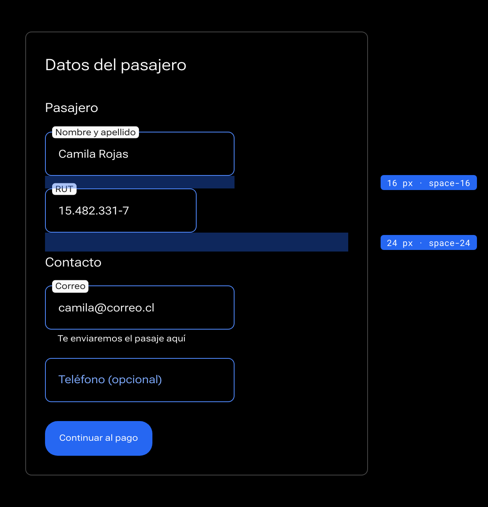

### Elegir el control

| El dato es | Usa |
|---|---|
| Texto corto | `TextInput` (con `type` e `inputMode` del dato: `email`, `tel`, `numeric`) |
| Texto largo | `Textarea` |
| Una opción de 2 o 3, visibles | `SegmentedControl` |
| Una opción de 3 a 5, con descripción | `RadioGroup` |
| Una opción de muchas | `PopUpButton` (hasta ~7) o `Combobox` (para buscar) |
| Varias opciones | `Checkbox` o `Combobox` múltiple |
| Sí o no, que se envía con el formulario | `Checkbox` |
| Una cantidad pequeña | `Stepper` |
| Un valor en un rango | `Slider` con su campo |
| Una fecha o una hora | `DatePicker` o `TimePicker` |
| Un archivo | `FileUploader` |

`Switch` no va en formularios: aplica el cambio al instante.

### Etiquetas y ayudas

- Toda pregunta tiene etiqueta visible. El texto de ejemplo (*placeholder*) no reemplaza a la etiqueta.
- La ayuda dice la regla **antes** de que se rompa: «Mínimo 4 caracteres».
- Marca lo opcional, no lo obligatorio, cuando casi todo es obligatorio: «Teléfono (opcional)».

### Validación

| Momento | Qué hacer |
|---|---|
| Mientras escribe | Nada, salvo contadores de caracteres. No marques error a medio escribir. |
| Al salir del campo | Valida el formato y muestra el error en el campo. |
| Al enviar | Valida todo. Si hay errores, muestra una `InlineNotification` de error arriba del formulario con cuántos son, y lleva el foco al primer campo con error. |

- El error va bajo el campo, en `text-error` y con `field-border-error`: nunca solo color.
- Dice cómo arreglarlo: «Escribe un correo con @», no «Correo inválido».

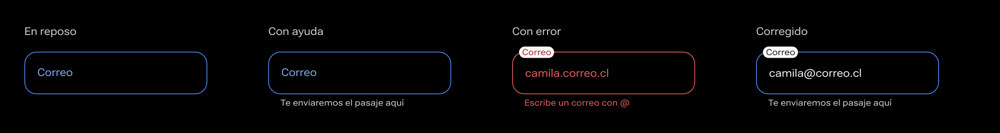

### Envío

- Un solo botón principal, al final, con el verbo de lo que pasa: «Pagar $7.000», «Crear cuenta».
- Enter en un campo envía el formulario (el botón principal es `type: 'submit'`).
- Mientras envía, el botón muestra `loading` con su `loadingLabel` («Pagando») y no acepta otro clic.
- Si todo sale bien, lleva a la siguiente pantalla o confirma con un `toast` de éxito.
- No desactives el botón de enviar esperando que el formulario esté completo: deja enviar y explica qué falta.

### Relacionados

`TextInput` · `ProgressIndicator` · `InlineNotification` · Guía de contenido.

## Estados vacíos

Qué mostrar cuando no hay nada que mostrar.

### Cuándo

Cuando una vista no tiene contenido: la primera vez, una búsqueda sin resultados, sin permiso o sin conexión.

### Anatomía

Usa `EmptyState`:

1. **Ícono** (opcional), en `icon-02`, a `icon-size-xl`.
2. **Título:** qué falta. «Aún no tienes viajes».
3. **Mensaje:** por qué, o qué verás aquí.
4. **Acción principal:** el siguiente paso. «Buscar pasajes».
5. **Acción secundaria** (opcional).

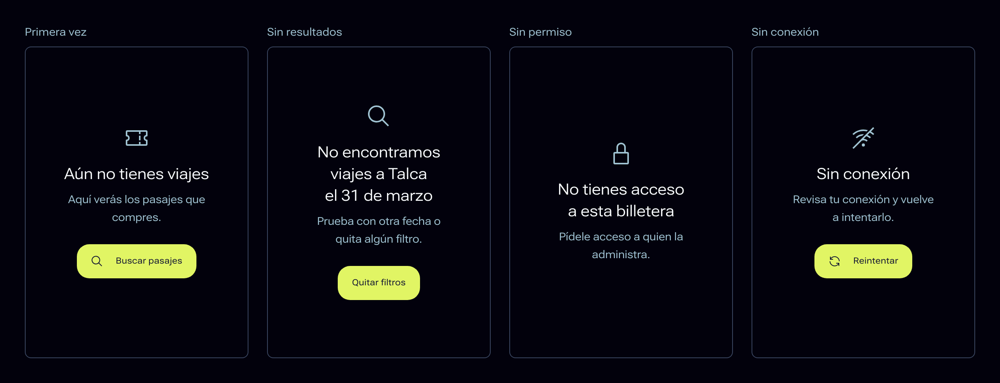

### Los casos

| Caso | Título | Mensaje | Acción |
|---|---|---|---|
| Primera vez | «Aún no tienes viajes» | «Aquí verás los pasajes que compres.» | «Buscar pasajes» |
| Sin resultados | «No encontramos viajes a Talca el 31 de marzo» | «Prueba con otra fecha o quita algún filtro.» | «Quitar filtros» |
| Sin permiso | «No tienes acceso a esta billetera» | «Pídele acceso a quien la administra.» | — |
| Sin conexión | «Sin conexión» | «Revisa tu conexión y vuelve a intentarlo.» | «Reintentar» |

### Reglas

- El estado vacío ocupa el lugar del contenido, no aparece encima.
- Sin ilustraciones decorativas que no sumen información; un ícono a lo sumo.
- No lo muestres mientras carga: eso es un estado de carga (ver **Carga**).
- En una tabla vacía, usa `emptyText` de `Table` con la misma lógica.

### Relacionados

`EmptyState` · `Table` · `SearchField` · Carga.

## Notificaciones

Cómo elegir el componente según el peso del mensaje.

### Elegir según el peso

| El mensaje | Usa | Se va |
|---|---|---|
| El error de un campo | El error de `TextInput` | Al corregirlo |
| Un resultado o un estado de una sección | `InlineNotification` | Al cerrarla o resolverla |
| Una guía antes de una tarea | `InlineNotification` `callout` | No se cierra |
| Un resultado pasajero que no pide nada | `toast` | Solo a los 5 s (éxito, información) |
| Algo que exige una decisión | `Alert` | Al responder |
| Un consejo sobre una función | `Tip` | Al descartarlo |

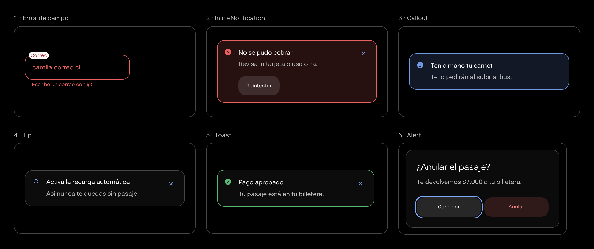

### Estados

| Estado | Úsalo para |
|---|---|
| Error | Algo falló y hay que corregirlo. |
| Advertencia | Algo puede fallar o tiene consecuencias. |
| Éxito | La acción terminó bien. |
| Información | Algo útil, sin urgencia. |

Cada estado lleva su ícono y su palabra; el color solo acompaña.

### Reglas

- **Cerca de donde ocurrió.** El resultado de guardar un formulario va arriba del formulario, no arriba de la página.
- **Una a la vez.** Si hay varios errores, agrúpalos en una notificación que diga cuántos son.
- **Lo que desaparece se puede recuperar.** Si un toast informa algo, eso también se ve en otra parte.
- **No interrumpas por lo que se puede deshacer.** Ofrece «Deshacer» en un toast en vez de preguntar antes.
- Mensajes con el orden «qué pasó» → «qué hacer»: «No pudimos cobrar tu pasaje. Revisa la tarjeta o usa otra.»

### Relacionados

`InlineNotification` · `ToastRegion` · `Alert` · `Tip` · Guía de contenido.

## Carga

Qué mostrar mientras algo tarda.

### Elegir según lo que se sabe

| Situación | Usa | Por qué |
|---|---|---|
| Se sabe cuánto falta (subir un archivo) | `ProgressBar` con valor | Muestra el avance real. |
| No se sabe cuánto falta, en una sección | `ProgressBar` sin valor o `ActivityIndicator` | Indica que sigue trabajando. |
| Llega una vista con estructura conocida (una lista, una tarjeta) | `Skeleton` | Muestra la forma antes que el contenido y evita saltos. |
| Una acción de un botón | `loading` del `Button` | La espera queda donde se hizo clic. |
| Una pantalla de marca que se prepara | `ProgressLine` | La línea azul que termina en verde. |

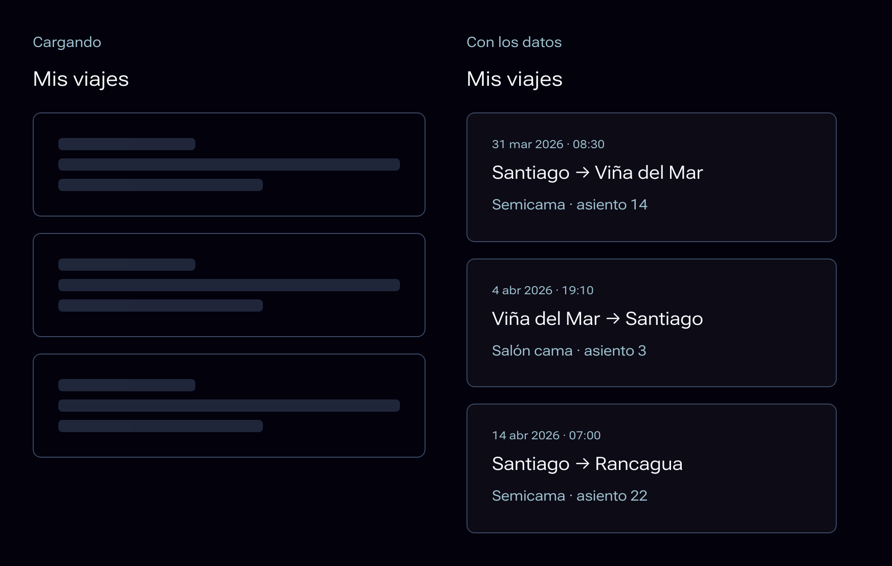

### Tiempos

| La espera dura | Muestra |
|---|---|
| Menos de 1 segundo | Nada. Un indicador que parpadea distrae más que la espera. |
| De 1 a 10 segundos | Un indicador (`Skeleton`, `ActivityIndicator` o `loading`). |
| Más de 10 segundos | Una barra con avance, qué está pasando y, si se puede, cancelar. |

### Reglas

- **Determinada siempre que se pueda.** Una barra con valor tranquiliza más que un spinner.
- `Skeleton` solo para contenedores y datos; nunca para botones, notificaciones ni toasts.
- El indicador va donde aparecerá el contenido, no en el centro de la pantalla.
- Di qué se está haciendo: «Buscando viajes», no «Cargando».
- Si la carga falla, reemplaza el indicador por el error y una forma de reintentar.
- Marca la zona como ocupada para el lector: `loading` en `Table` (que pone `aria-busy`), `label` en `Skeleton` y `ActivityIndicator`.

### Relacionados

`ProgressBar` · `ActivityIndicator` · `Skeleton` · `ProgressLine` · `Button`.

## Búsqueda y filtros

Cómo ayudar a encontrar: buscar, acotar y ordenar.

### Buscar

Usa `SearchField`:

- **El texto de ejemplo dice qué se puede buscar:** «Buscar viajes, ciudades o terminales».
- **Busca mientras se escribe** (`onChange`), sin esperar Enter, si la respuesta es rápida.
- **Sugerencias** recientes o predictivas (hasta 8) mientras escribe.
- **Alcance** (`scopes`): si se puede buscar en distintas áreas, empieza por la más amplia.
- Los resultados muestran la palabra buscada y cuántos hay: «12 viajes a Talca».

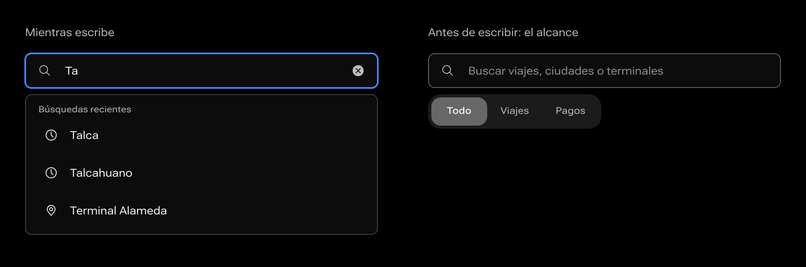

### Filtrar

| Cantidad de filtros | Usa |
|---|---|
| Pocos y frecuentes (2 a 6) | `Tag` seleccionables, en una fila sobre los resultados |
| Un criterio con 2 o 3 valores | `SegmentedControl` |
| Muchos filtros | Un panel (`Sheet` en el teléfono) con los controles de **Formularios** |

- Los filtros aplicados se ven como `tokens` en el `SearchField` o como `Tag` que se pueden quitar.
- Ofrece «Quitar filtros» cuando hay alguno.
- Aplica al instante con pocos filtros; en un panel con muchos, con un botón «Ver 12 resultados».

### Ordenar

- En tablas, con los encabezados ordenables de `Table`.
- En listas y tarjetas, con un `PopUpButton` «Ordenar por», con la opción más útil por defecto.

### Sin resultados

Usa el estado vacío de **Estados vacíos**: di qué se buscó y sugiere cómo ampliar la búsqueda.

### Relacionados

`SearchField` · `Tag` · `SegmentedControl` · `PopUpButton` · `Table` · `Sheet`.

## Diálogos y capas

Cómo elegir entre Modal, Sheet, Alert y Popover.

### Elegir la capa

| Necesitas | Usa | Bloquea la página |
|---|---|---|
| Una tarea breve con foco (editar un dato, confirmar un pago) | `Modal` | Sí |
| Opciones sobre lo que se ve, al alcance del pulgar | `Sheet` | Sí |
| Una advertencia que exige respuesta, con 2 o 3 opciones | `Alert` | Sí |
| Explicar algo o un par de controles, junto a un botón | `Popover` | No |
| Decir qué hace un control | `Tooltip` | No |
| Una tarea larga o con varios pasos | Una página | — |

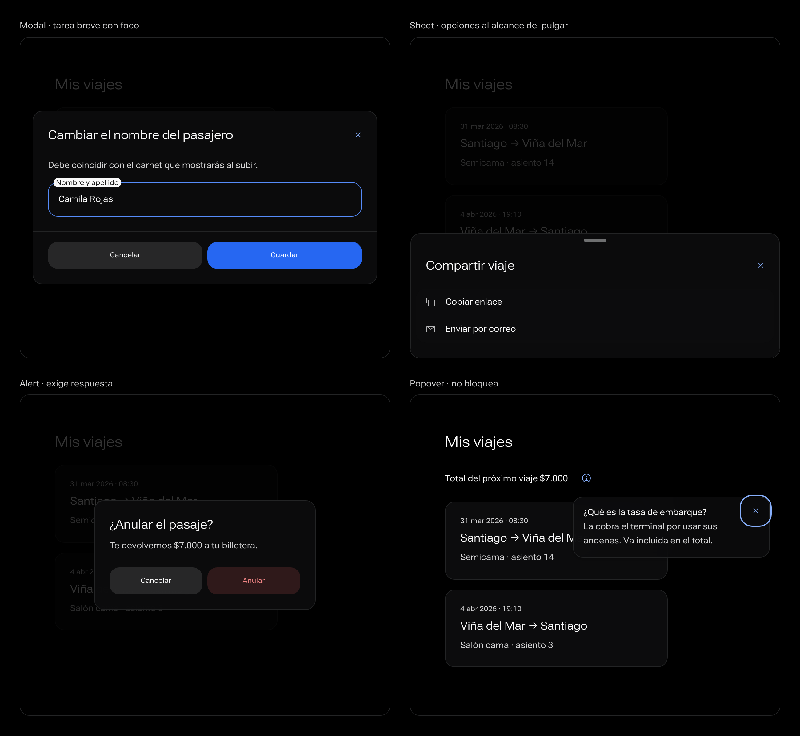

### Reglas

- **Una capa a la vez.** Un modal no abre otro modal. Si una tarea crece, llévala a una página.
- **La persona la abre.** No abras un diálogo sin que lo pida, salvo una alerta que no puede esperar.
- **Siempre hay salida:** «Cerrar», «Cancelar» o Esc. Quitarla es la excepción.
- **El foco entra y vuelve.** Al abrir entra al diálogo; al cerrar vuelve al botón que lo abrió (ALMA lo hace).
- **Confirma solo lo que no se deshace.** Para lo que se puede deshacer, actúa y ofrece «Deshacer».

### Confirmar una acción destructiva

Depende de quién empezó.

| La persona | Usa | Por qué |
|---|---|---|
| Eligió la acción: tocó «Eliminar» en un menú o en una fila. | `ActionSheet` | Responde a algo que hizo. Aparece en otro lugar y hay que cerrarlo a propósito. |
| No la eligió: el sistema avisa de algo que va a perderse. | `Alert` | Llega sin que la pida, y por eso interrumpe más. |

En los dos casos:

1. El título es una pregunta concreta: «¿Eliminar la tarjeta terminada en 4821?».
2. Los botones son «Cancelar» y el verbo del título: «Eliminar».
3. **La acción que destruye nunca es la más visible.** Va en rojo y con poco peso; «Cancelar» recibe el foco, y Enter no borra nada.

### Relacionados

`Modal` · `Sheet` · `Alert` · `ActionSheet` · `Popover` · `Tooltip` · Menús · Jerarquía.

## Acciones

Cómo ordenar los botones: prominencia, cantidad y posición.

### Prominencia

| Estilo | Para |
|---|---|
| `filled` | La acción más probable. **1 o 2 por vista.** |
| `tinted` | La segunda acción que importa. |
| `gray` | Lo neutro: «Cancelar», «Volver». Es el de menos peso entre los que tienen fondo. |
| `plain` | Lo menor y lo repetido: en filas y en barras de herramientas. |
| `tertiary` | Contorno, del theme de origen de Cordura. |

El orden de peso es ese: `filled`, `tinted`, `gray`, `plain`. El detalle está en el patrón **Jerarquía**.

El rol cambia el significado, no la prominencia: `destructive` pinta de rojo cualquier estilo. Una acción que destruye nunca va en `filled`.

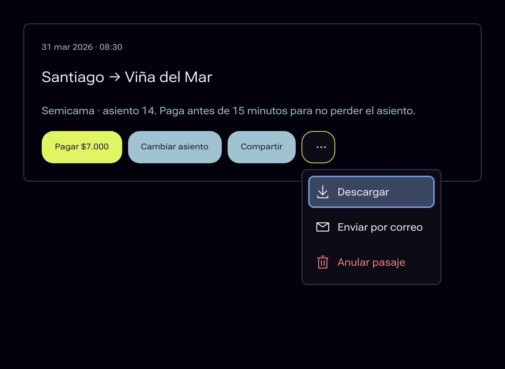

### Cantidad

- Muestra pocas acciones a la vista; el resto va en el menú «Más» (`moreActions` de `Toolbar` o un `PullDownButton`).
- La acción destructiva va al final del menú, separada.

### Posición

| Lugar | Orden |
|---|---|
| Pie de un diálogo | «Cancelar» a la izquierda, la acción a la derecha. |
| Final de un formulario | Alineados con los campos. Si hay «Cancelar», va a la izquierda de la acción principal, como en los diálogos. |
| Barra de herramientas | Las más usadas a la derecha, como íconos; el resto en «Más». |
| Fila de una lista o tarjeta | Una sola acción por fila. |

### Etiquetas

- Verbo primero, que diga lo que pasa: «Pagar $7.000», «Eliminar tarjeta».
- Nunca «Sí», «OK» o «Aceptar» si hay algo más preciso.
- Botones de solo ícono: con `aria-label` y, si ayuda, un `Tooltip`.

### Desactivar o no

Prefiere dejar el botón activo y explicar al pulsarlo qué falta. Un botón desactivado no dice por qué (ver **Desactivado y solo lectura**).

### Relacionados

`Button` · `PullDownButton` · `Toolbar` · Guía de contenido.

## Desactivado y solo lectura

Cuándo desactivar un control y cómo mostrar lo que no se puede editar.

### Desactivado

Un control desactivado se ve, pero no responde (al 45 % de opacidad en ALMA).

**Úsalo** cuando la acción existe pero hoy no se puede hacer, y es obvio por qué: «Página siguiente» en la última página.

**Evítalo** cuando la persona no entendería por qué:
- Un botón «Pagar» desactivado hasta completar el formulario: mejor dejarlo activo y marcar lo que falta al pulsarlo.
- Un ítem de `TabBar` o `Sidebar`: nunca se desactivan; si una sección está vacía, se explica dentro.

Si desactivas algo que no es obvio, di por qué cerca del control («Disponible desde el 1 de abril»).

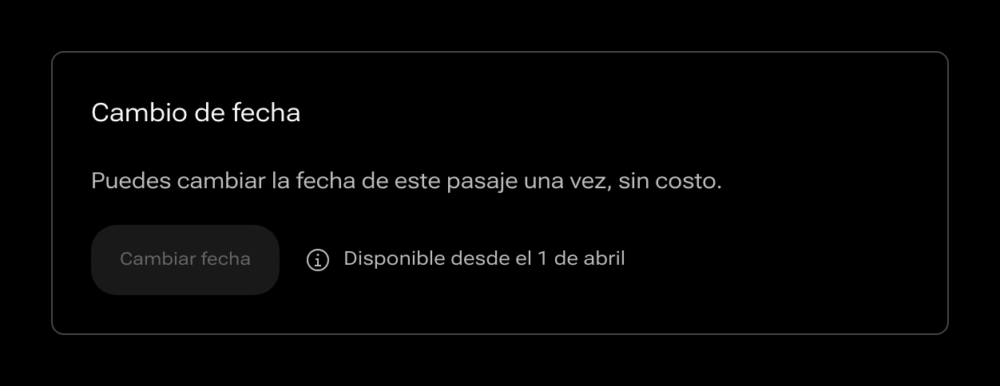

### Solo lectura

Un dato que la persona puede ver pero no cambiar (el RUT de la cuenta, el número de un pasaje).

- **Dentro de un formulario**, usa `TextInput` o `Textarea` con `readOnly`: borde punteado, texto con contraste normal, se puede enfocar y copiar, pero no cambiar. Así el dato queda alineado con los demás campos.
- **Fuera de un formulario**, muéstralo como texto: una fila informativa de `List` (título y `trailing`) o un par etiqueta y valor.
- Nunca uses un campo desactivado para esto: baja el contraste, no se puede copiar y parece un error.
- Si el dato se puede copiar, ofrece un botón «Copiar» junto a él.
- Si se puede cambiar en otro lugar, ofrece el camino: «Cambiar en Ajustes».

### Accesibilidad

- Un control desactivado no recibe foco: quien usa teclado o lector puede no saber que existe. Por eso, explicar en texto es más importante que desactivar.
- El texto de solo lectura cumple el contraste normal (4,5:1); el desactivado está exento, y por eso no sirve para mostrar datos.
- Un campo `readOnly` se anuncia como «solo lectura» y recibe foco; uno desactivado no.

### Relacionados

`Button` · `List` · `TextInput`.

## Contenido que desborda

Qué hacer cuando el texto o los datos no caben.

### Texto que no cabe

| Dónde | Qué hacer |
|---|---|
| Etiquetas de botones y pestañas | Acorta el texto; no las cortes con puntos suspensivos. |
| Destinos de `Sidebar` | Se cortan con puntos suspensivos; usa etiquetas cortas. |
| Celdas de `Table` | `maxChars` recorta en el medio (conserva principio y final); el texto completo aparece al pasar el cursor. |
| Títulos de página | Pasan a otra línea, equilibrados. Nunca se cortan. |
| Texto de lectura | Pasa a otra línea; ancho máximo de 48 rem. |

Truncar esconde información: úsalo solo donde el texto completo está a un paso (el detalle, el tooltip).

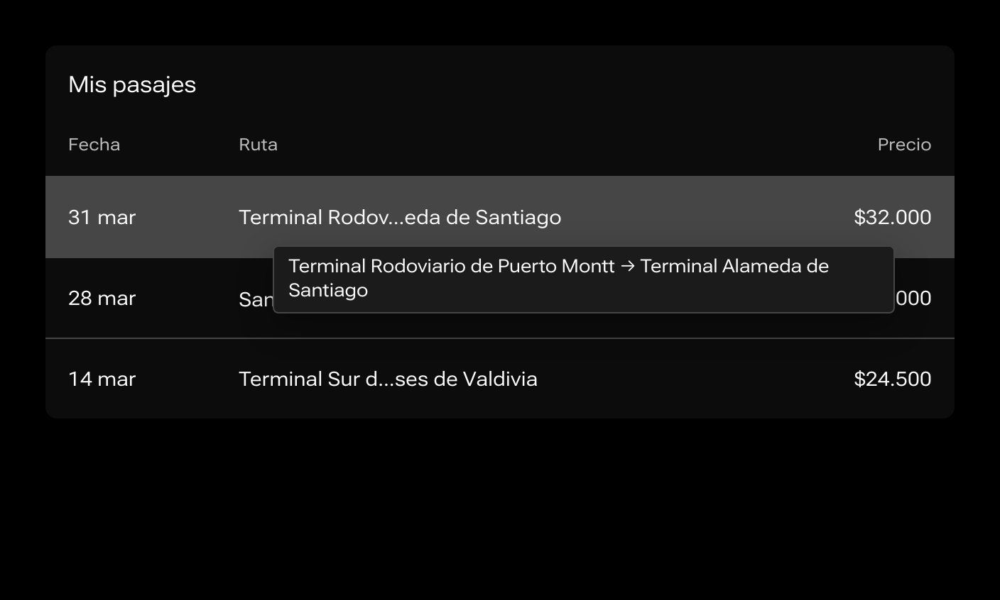

### Muchos elementos

| Situación | Qué hacer |
|---|---|
| Muchas pestañas | Más de 6: elige la vista con un `PopUpButton`. |
| Una ruta larga | `Breadcrumb` pliega los niveles del medio en «…». |
| Muchas acciones | Las frecuentes a la vista; el resto en «Más». |
| Muchas filas | `Pagination` debajo de la tabla. |
| Una tabla ancha | Se desplaza hacia el lado dentro de su contenedor; la página no. |

### Texto agrandado

El texto de ALMA crece con la preferencia de la persona (probado al 200 %). Diseña para eso:
- Deja que los contenedores crezcan en alto; no fijes altos con texto dentro.
- Evita anchos fijos en px para lo que tiene texto; usa `rem`.
- La página nunca se desplaza hacia el lado: solo las tablas y los bloques de código, dentro de su caja.

### Relacionados

`Table` · `Breadcrumb` · `Tabs` · `Pagination` · Tipografía.

## Encabezado y navegación global

La estructura fija de una app: barra superior y navegación principal.

### Cuándo

En toda app o sitio hecho con ALMA: es lo que queda fijo mientras cambia el contenido.

### Las piezas

| Pieza | Componente | Qué lleva |
|---|---|---|
| Barra superior | `Toolbar` con `sticky` | Título de la vista, Volver, buscador y 2 o 3 acciones; el resto en «Más». |
| Navegación principal (teléfono) | `TabBar` con `fixed` | De 3 a 5 secciones. |
| Navegación principal (desde 1056 px) | `Sidebar` | Las mismas secciones, agrupadas. |
| Cuenta | `PullDownButton` de ícono `user--avatar` en la `Toolbar` | Perfil, Ajustes, Cerrar sesión. |

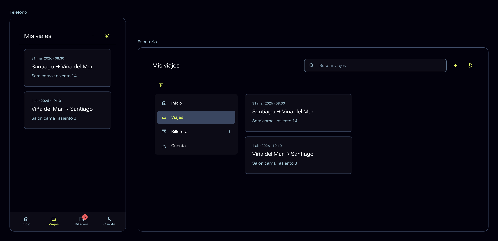

### Reglas

- **Los mismos destinos en todas las pantallas.** `TabBar` y `Sidebar` son la misma navegación en dos formas: cambia la forma, no los destinos.
- **La barra superior dice dónde estás:** su título es el de la vista.
- **La búsqueda global**, si existe, va en la `Toolbar`; bajo 672 px pasa a su propia fila.
- **Cerrar sesión** va al final del menú de cuenta, con `role: 'destructive'` solo si borra datos locales.
- **Primer enlace de la página:** «Saltar al contenido», que lleva al título de la vista.

### Capas

`Toolbar` y `TabBar` fijas usan `z-header`. Deja espacio bajo el contenido para que la `TabBar` no tape el último control.

### Accesibilidad

- La `Toolbar` es el `header` de la página y el contenido va en `main`.
- `TabBar` y `Sidebar` son `nav`; si hay más de un `nav`, cada uno lleva su nombre.
- Al cambiar de sección, el foco va al título de la vista nueva.

### Relacionados

`Toolbar` · `TabBar` · `Sidebar` · `PullDownButton` · Espaciado y grilla.

## Inicio de sesión

Cómo pedir las credenciales sin trabas y con los errores claros.

### Cuándo

Para entrar a una cuenta, y en cualquier pantalla que pida la contraseña de nuevo.

### Estructura

1. Título: «Ingresa a tu cuenta».
2. Correo: `TextInput` con `type: 'email'` y `autoComplete: 'username'`.
3. Contraseña: `TextInput` con `type: 'password'` y `autoComplete: 'current-password'`. Trae el ojo para mostrarla.
4. Enlace «¿Olvidaste tu contraseña?», bajo la contraseña.
5. Botón `filled`, `type: 'submit'`: «Ingresar».
6. Debajo, un enlace para crear una cuenta.

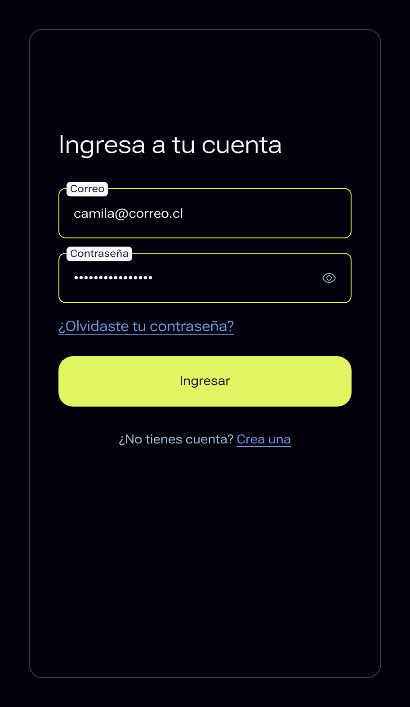

### Reglas

- **Deja pegar y deja usar el gestor de contraseñas.** No bloquees el pegado ni desactives el autocompletado (WCAG 3.3.8, autenticación accesible).
- **Sin pruebas de memoria ni acertijos** para entrar. Si hace falta verificar a una persona, ofrece un método que no exija recordar ni transcribir.
- **Al crear una cuenta**, usa `autoComplete: 'new-password'` y di la regla antes: «Mínimo 8 caracteres».
- **Mientras ingresa**, el botón muestra `loading` con `loadingLabel: 'Ingresando'`.
- **Enter en cualquier campo** envía.

### Errores

| Caso | Qué mostrar |
|---|---|
| Falta un dato | El error en el campo: «Escribe tu correo». |
| Correo o contraseña no coinciden | Una `InlineNotification` de error sobre el formulario: «El correo o la contraseña no coinciden». No digas cuál de los dos, por seguridad. |
| Demasiados intentos | La notificación dice cuánto esperar o cómo recuperar la cuenta. |
| Sin conexión | «No se pudo conectar. Revisa tu conexión y vuelve a intentarlo.» |

Al fallar, deja escrito el correo y lleva el foco a la notificación o al primer campo con error.

### Cerrar sesión

En el menú de cuenta. No pidas confirmación salvo que se pierdan datos sin guardar.

### Relacionados

`TextInput` · `Button` · `InlineNotification` · `Link` · Formularios.

## Indicadores de estado

Cómo mostrar el estado de algo sin depender del color.

### Cuándo

Para decir en qué estado está un elemento: un pago, un viaje, una tarjeta, un archivo.

### Elegir la forma

| Situación | Usa |
|---|---|
| El estado de un elemento en una lista o tabla | `Tag` con la palabra del estado («Pagado», «Pendiente»). |
| Un estado del sistema que importa | Ícono relleno de estado + palabra. |
| Un resultado que pide atención | `InlineNotification`. |
| Algo nuevo o pendiente en la navegación | La insignia (`badge`) de `TabBar` o `Sidebar`. |
| El avance de algo | `ProgressBar` o `ProgressIndicator`. |

### Íconos de estado

| Estado | Ícono (`variant: 'filled'`) | Token |
|---|---|---|
| Error | `error` | `status-icon-error` |
| Advertencia | `warning` | `status-icon-warning` |
| Éxito | `checkmark--outline` | `status-icon-success` |
| Información | `information` | `status-icon-info` |

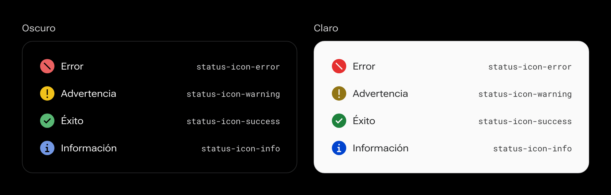

### Reglas

- **Tres pistas, no una:** forma (el ícono), palabra y color. Si falta el color, las otras dos bastan.
- **La palabra informa:** «Pagado» dice más que un punto verde.
- **Los cuatro íconos de estado tienen formas distintas**, así se distinguen sin color.
- **Pocos estados:** si hay más de cinco, agrupa.
- **El mismo estado se ve igual en toda la app:** mismo color de `Tag`, misma palabra.

### Accesibilidad

- El ícono de estado lleva `label` si no hay palabra al lado.
- Los estados que cambian solos se anuncian en una región `role="status"`.

### Relacionados

`Tag` · `Icon` · `InlineNotification` · `ProgressBar` · Notificaciones.

## Barra de texto

Las acciones de formato sobre un texto editable.

### Cuándo

Cuando un texto largo necesita formato (negrita, listas, enlaces): una nota, una descripción, un mensaje.

### Estado en ALMA

ALMA **no tiene hoy un editor de texto con formato**. `Textarea` es texto sin formato. Si un producto necesita formato, se pide como un componente nuevo de ALMA; mientras tanto, este patrón fija cómo debe comportarse.

### Cómo debe ser

1. Una fila de botones de ícono sobre el texto, dentro del mismo contenedor.
2. Cada formato es un botón que se prende y apaga (`Button` con `selected`), en grupos separados: estilo del texto, listas, enlace.
3. Los íconos de Carbon: `text--bold`, `text--italic`, `text--underline`, `list--bulleted`, `list--numbered`, `link`. No vienen en el set incluido: se cargan con `AlmaDS.registerIcons` desde `carbon-icons.json`.
4. Cada botón lleva su nombre y su atajo en un `Tooltip`: «Negrita (⌘B)».

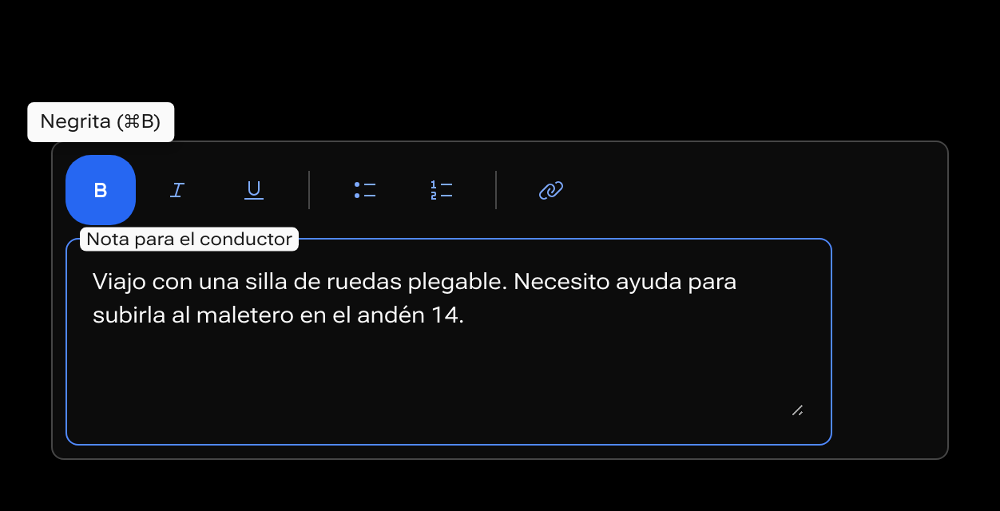

### Reglas

- **Pocos formatos.** Solo los que el contenido necesita; el resto, en «Más».
- **El atajo de teclado siempre funciona**, esté o no la barra a la vista.
- **El estado se ve:** el formato activo queda marcado con `selected`, no solo con color.

### Accesibilidad

- La fila es un `role="toolbar"` con nombre («Formato del texto»), con una sola parada de Tab y flechas para moverse entre botones.
- Cada botón anuncia si está activo (`aria-pressed`).

Esto último **no lo resuelve ALMA hoy**: forma parte del componente que habría que agregar.

### Relacionados

`Textarea` · `Button` · `Tooltip` · `Icon`.

## Campos fluidos

Cómo se comportan los campos de ALMA en formularios densos y en grillas.

### Qué son

En Carbon, los campos «fluidos» llevan la etiqueta dentro del campo y se pegan unos a otros para formularios densos. En ALMA, **todos los campos ya llevan la etiqueta dentro**: `TextInput`, `Textarea`, `DatePicker` y `TimePicker` son píldoras con la etiqueta flotante. No hay una variante aparte.

### Cómo funciona la etiqueta

| Estado | Etiqueta |
|---|---|
| Vacío y sin foco | Dentro del campo, en el lugar del texto. |
| Con foco o con texto | Sube al borde superior, sobre un fondo propio (`field-label-float-bg`). |
| Con error | Sube y cambia a `field-label-float-error`. |

El texto de ejemplo solo se ve con el campo enfocado: nunca compite con la etiqueta.

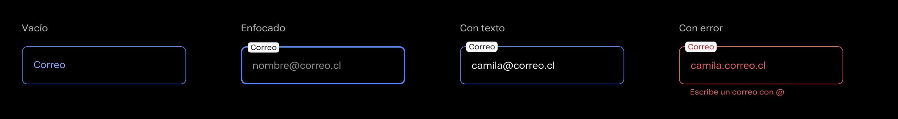

### En grillas

- **Una columna por defecto.** Pon campos en fila solo si forman un dato (fecha y hora de un viaje; día, mes y año).
- **Separación:** `space-16` entre campos y `space-24` entre grupos, también en fila.
- **Mismo alto:** todos los campos miden 56 px (40 px en densidad compacta), así las filas se alinean.
- **Ancho según el dato:** el ancho sugiere el largo de lo que se escribe.

### Formularios densos

En herramientas de trabajo de escritorio, usa la densidad compacta (`data-density="compact"`): los campos bajan a 40 px y el resto no cambia. No existe una variante de campos pegados sin separación.

### Relacionados

`TextInput` · `DatePicker` · Formularios · Espaciado y grilla.

## Divulgación progresiva

Cómo mostrar primero lo esencial y el resto a pedido.

### Cuándo

Cuando hay más información de la que la mayoría necesita: detalles, condiciones, opciones avanzadas.

### Elegir la forma

| Lo que se esconde | Usa |
|---|---|
| Secciones de contenido largo | `Accordion` |
| El detalle de una tarjeta | `Accordion` (se despliega) o `Card` (lleva a otra página) |
| Una explicación breve de un término | `Popover` |
| Qué hace un control | `Tooltip` |
| Opciones relacionadas con lo que se ve | `Sheet` |
| Acciones secundarias | El menú «Más» (`PullDownButton`) |
| Un texto largo | Un `Link` «Ver más» que lleva al texto completo |

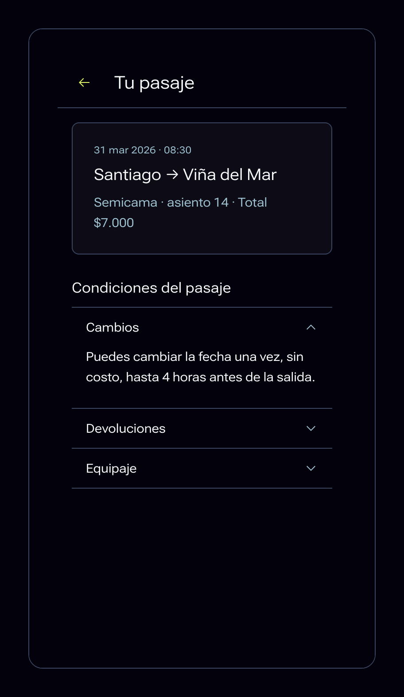

### Reglas

- **Lo esencial, a la vista.** Lo que casi todos necesitan no se esconde.
- **Nunca se esconden los errores** ni lo que hace falta para decidir.
- **Un nivel.** No pongas un despliegue dentro de otro.
- **El control dice qué muestra:** «Ver condiciones del pasaje», no «Más».
- **Lo abierto se queda abierto** mientras la persona está en la pantalla.

### Accesibilidad

- El control que despliega anuncia si está abierto (`aria-expanded`); ALMA lo hace en `Accordion`, `Popover` y `PullDownButton`.
- Lo escondido queda oculto también para el lector.

### Relacionados

`Accordion` · `Popover` · `Sheet` · Contenido que desborda.

## Portada

La primera pantalla de una entidad: algo escaneado dibujado en puntos, su nombre y pocas palabras alrededor.

### Cuándo

Para abrir: la página de inicio de una entidad, el comienzo de una campaña, una bienvenida. Una portada presenta, no explica; lo que hay que leer con calma va debajo de ella.

No la uses dentro de un producto. Ahí la persona viene a hacer algo, y una portada la hace esperar.

### Tres clases

Las tres parten de un escaneo (un objeto, un lugar o un suelo) pasado a una trama de puntos, y se eligen según lo escaneado.

| Clase | Qué se escanea | Qué hace el desplazamiento | Dónde va el nombre |
|---|---|---|---|
| Con objeto | Algo que se puede rodear: un busto, una pieza. | Los puntos se separan en grupos, uno junto a cada dato. | Detrás del objeto, grande. |
| Recorrido | Un lugar con paredes: un pasillo, un túnel. | Se avanza por dentro, a la altura de los ojos. | En la salida: pequeño al principio, entero al llegar. |
| Sobrevuelo | Un suelo sin paredes: un relieve, un mar de nubes. | Se vuela bajo sobre él, mirando un poco hacia abajo. | Sobre el horizonte. |

### Estructura

Toda portada tiene las mismas cinco partes, y ninguna más.

1. **El nombre.** La palabra de la entidad, como pieza viva: se escribe letra por letra y su peso responde al puntero.
2. **La figura.** Lo escaneado, dibujado en puntos con los tres colores de la entidad. Lleva una descripción para quien no la ve.
3. **La entrada.** Una frase de dos o tres líneas, una sola acción `filled` y una pista de qué hacer. Siempre sobre un recuadro con el fondo de la página.
4. **Los datos.** Hasta cuatro frases cortas que aparecen al desplazar, cada una sobre su recuadro.
5. **El tema.** Un `Button` `plain` de solo ícono, arriba a la derecha, para pasar de oscuro a claro.

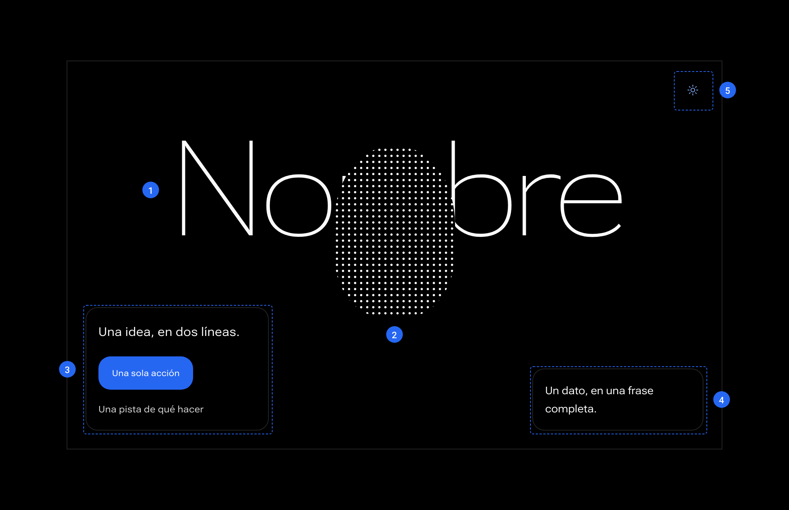

Debajo de la portada va el contenido que sí se lee: la acción de la entrada lleva ahí.

#### Fondos

Una portada con objeto puede llevar, bajo todo lo demás, fondos de la colección de Efectos en dos momentos: detrás de la figura mientras está entera, y en su lugar cuando ya se deshizo. En un mismo momento caben dos, uno sobre otro, si el de arriba deja ver el de abajo.

Un fondo y un texto nunca se encuentran. Los fondos del primer momento se apagan al empezar a desplazar, antes de que llegue ningún dato. Los del segundo esperan: primero la figura se deshace y los datos se leen sobre la página limpia; después los puntos y los datos se van juntos; y solo entonces entra el fondo. Así los datos no necesitan recuadro ni nada detrás, y la portada es un poco más larga, porque tiene una cosa más que mostrar al final.

Las tres portadas con busto (Cordura, Ensayo y Autómata) entran sin fondo. Cuando el busto se deshizo y sus datos ya se leyeron y se fueron, baja el Velo desde lo alto y aparece el Halo al centro, latiendo, cada una con los colores de su entidad.

Con un fondo al final, los cuatro datos forman un marco: los de arriba alineados por arriba, los de abajo por abajo.

### Contenido

- **La frase dice una idea**, no describe la figura. «Un primer borrador nunca es el texto. Es el material.»
- **Una acción.** Si hacen falta dos, no es una portada: es una página.
- **Los datos son frases completas** y se entienden solos, porque aparecen de a uno.
- **El texto nunca va sobre los puntos.** Todo lo que se lee tiene su recuadro: los puntos cambian con el tema y con el movimiento, y el contraste no se puede prometer de otro modo.

### Color

La figura usa tres colores de la entidad y ninguno más, repartidos por zonas: de arriba abajo en un objeto; bóveda, paredes y suelo en un recorrido; cimas, laderas y hondonadas en un sobrevuelo. En tema claro los puntos son tinta: marcan lo oscuro de la figura en vez de lo claro.

### Movimiento

Una portada es el único lugar, junto con la firma, donde vale el movimiento de marca. Sus recetas (escribirse, armarse, deshacerse, responder, avanzar y descansar) y la medida contenida están en Movimiento › Coreografía.

### Accesibilidad

- **Todo el texto es texto.** El nombre, la frase y los datos están en la página aunque la figura no cargue.
- **La figura tiene descripción** y no recibe el foco: no hay nada que operar en ella.
- **Con teclado** se llega al tema, al nombre (las flechas mueven su peso) y a la acción. Si la acción ya no está a la vista, la página vuelve al inicio al enfocarla.
- **Con movimiento reducido** todo aparece armado y escrito: sin polvo, sin granos y sin giro. El desplazamiento sigue funcionando.
- **Nada depende del puntero.** Girar la mirada o revolver los puntos es un añadido; quien no lo hace no pierde contenido.

### No hagas

- No pongas más de una portada en una página.
- No escribas sobre los puntos sin recuadro.
- No uses colores que no sean los tres de la entidad.
- No hagas que algo avance solo: quien lee marca el paso.
- No uses una portada para mostrar un escaneo que no dice nada de la entidad.

## Bienvenida

La primera vez de alguien en un producto: cuánto decirle antes de dejarlo empezar.

### Cuándo

Solo la primera vez, y solo si el producto no se explica al usarlo. La mejor bienvenida es la que no hace falta: una primera pantalla clara, con un estado vacío que dice qué hacer.

Antes de diseñar una, prueba sin ella. Si la gente llega sola a su primera tarea, no la pongas.

### Tres formas

Elige la más liviana que alcance.

| Forma | Qué es | Cuándo |
|---|---|---|
| Sin bienvenida | El estado vacío hace el trabajo: dice qué falta y ofrece el primer paso. | Casi siempre. |
| Pistas en contexto | Un `Tip` junto a lo que explica, la primera vez que hace falta. | Una función que no se descubre sola. |
| Recorrido | De una a tres pantallas antes de empezar. | Algo que hay que entender o decidir antes del primer uso. |

### Principios

1. **Empezar haciendo.** Se aprende más con la primera tarea que leyendo sobre ella. Lleva a la persona a hacer algo real cuanto antes.
2. **Breve.** Tres pantallas como máximo, una idea por pantalla.
3. **Siempre se puede saltar.** «Saltar» está a la vista desde la primera pantalla, y saltar no quita nada.
4. **Pedir cuando se necesita.** Un permiso o un dato se pide en el momento en que sirve, no todo junto al inicio.
5. **Mostrar antes de pedir cuenta.** Deja ver para qué sirve el producto antes de exigir registro.
6. **Una sola vez.** No vuelve en cada visita. Lo que enseña queda al alcance después, en Ayuda.

### Anatomía de un recorrido

1. **Figura** (opcional): una ilustración o una captura que muestre la idea.
2. **Título:** qué se puede hacer, en pocas palabras. «Compra tu pasaje en un minuto».
3. **Una frase:** lo que hay que saber, y nada más.
4. **`PageControl`:** dónde va y cuánto falta.
5. **Acción principal** `filled`: «Continuar», y en la última, la primera tarea: «Buscar pasajes».
6. **«Saltar»** `plain`, siempre en el mismo lugar.

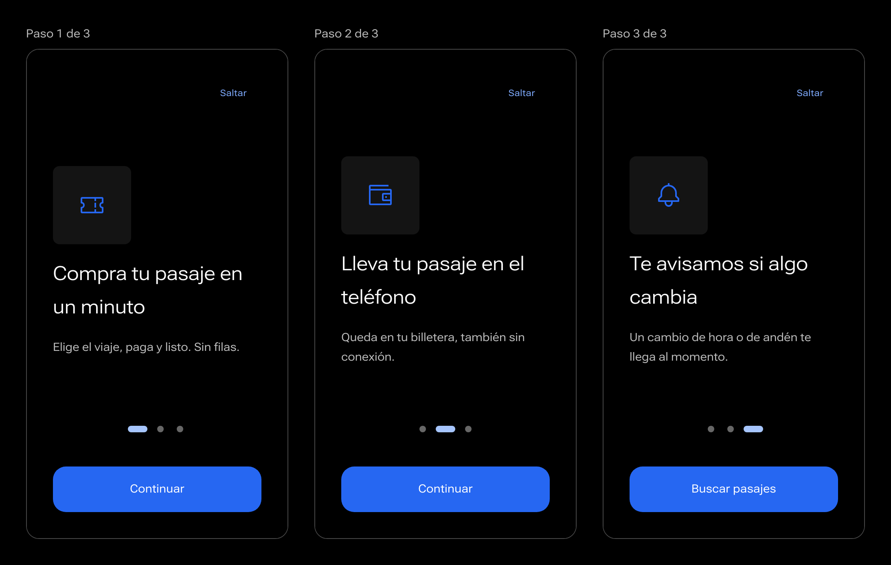

### Permisos y datos

| Qué se pide | Cuándo pedirlo | Cómo |
|---|---|---|
| Notificaciones | Después de la primera compra, cuando hay algo que avisar. | Di antes para qué: «Te avisamos si cambia tu salida». |
| Ubicación | Al tocar «Cerca de mí». | Ofrece seguir sin darla: escribir la ciudad. |
| Cuenta | Al guardar o pagar. | Deja mirar y buscar sin cuenta. |
| Datos personales | En el formulario que los usa. | Solo los que ese paso necesita. |

Si la persona dice que no, el producto sigue funcionando, y la opción queda en Ajustes.

### Contenido

- Habla de lo que la persona logra, no de las funciones: «Lleva tu pasaje en el teléfono», no «Billetera digital integrada».
- Sin signos de exclamación ni bienvenidas largas.
- El último botón nombra la primera tarea, no dice «Empezar».

### Accesibilidad

- Un lector de pantalla anuncia la posición: «Paso 1 de 3».
- Al pasar de pantalla, el foco va al título nuevo.
- Nada avanza solo ni tiene tiempo límite.
- Con movimiento reducido, las pantallas cambian sin deslizarse.

### No hagas

- Un recorrido que repite lo que la interfaz ya dice.
- Pedir todos los permisos de una vez al abrir.
- Esconder «Saltar» o ponerlo solo al final.
- Un video o una animación que no se puede detener.

### Relacionados

`PageControl` · `Tip` · `EmptyState` · Estados vacíos · Inicio de sesión · Ajustes.

## Ajustes

Dónde van las preferencias de una persona, cuántas ofrecer y cuándo se aplican.

### Cuándo

Para lo que una persona decide una vez y deja así: idioma, tema, avisos, privacidad, cuenta.

Un ajuste es una decisión que el diseño no tomó. Antes de agregar uno, busca un buen valor por defecto. Mientras menos ajustes, mejor.

### Dónde va cada cosa

| Qué es | Dónde va |
|---|---|
| Algo que se cambia mientras se hace una tarea (ordenar, filtrar, ver como lista). | Ahí mismo, junto a la tarea. No en Ajustes. |
| Una preferencia general, que se cambia rara vez. | En Ajustes. |
| Lo que el sistema ya sabe (tema claro u oscuro, idioma, movimiento reducido). | Se sigue al sistema. Se ofrece como ajuste solo para cambiarlo aquí. |

### Estructura

- **Grupos con nombre**, de lo más usado a lo menos usado: Cuenta, Avisos, Apariencia, Privacidad.
- **Una fila por ajuste**, en `List`: el nombre a la izquierda y el control o el valor actual a la derecha.
- **Con muchos ajustes**, navegación propia: `Sidebar` desde `bp-lg`, una lista que lleva a cada grupo en el teléfono. Y un `SearchField` arriba.
- **Lo peligroso, al final** y separado: cerrar sesión, eliminar la cuenta.

### Qué control usar

| El ajuste es | Control |
|---|---|
| Sí o no | Una fila de `List` con su interruptor (`switch`) |
| Una de dos a cuatro opciones cortas | `SegmentedControl` |
| Una de muchas | `PopUpButton` |
| Un valor en un rango | `Slider` |
| Un texto (nombre, correo) | Una fila que abre un formulario |
| Varias opciones a la vez | `Checkbox` en lista |

### Cuándo se aplica

- **Al tiro, sin «Guardar»:** un interruptor, una opción, un `Slider`. El cambio se ve de inmediato y se deshace volviendo a tocar.
- **Con «Guardar»:** lo que se escribe (nombre, correo, clave) y lo que tiene consecuencias (cambiar de plan). Ahí va un formulario, con «Guardar» y «Cancelar».
- No mezcles las dos formas en un mismo grupo.

Si un cambio no se puede aplicar, dilo en la fila y vuelve el control a donde estaba.

### Contenido

- El nombre dice qué pasa cuando está activo: «Avisarme si cambia mi salida», no «Notificaciones de itinerario».
- Una línea de ayuda bajo el nombre solo si el nombre no alcanza.
- La fila muestra el valor actual: «Idioma · Español».

### Accesibilidad

- Cada control tiene su nombre asociado: al enfocarlo, un lector lee el nombre del ajuste y su estado.
- Los grupos son encabezados, para saltar entre ellos.
- Toda la fila responde al toque, no solo el control.
- Un cambio que se aplica solo se anuncia: «Tema oscuro activado».

### No hagas

- Un ajuste para algo que casi nadie cambia.
- Esconder en Ajustes lo que se necesita durante una tarea.
- Pedir confirmación para un cambio que se deshace con un toque.
- Un «Restablecer todo» sin decir qué se pierde.

### Relacionados

`List` · `Switch` · `SegmentedControl` · `PopUpButton` · `Sidebar` · Formularios · Diálogos · Temas.

## Arrastrar y soltar

Mover algo tomándolo, y la manera de hacer lo mismo sin arrastrar.

### Cuándo

Para reordenar una lista, mover algo de un grupo a otro o traer archivos a la página. Es rápido para quien usa mouse o el dedo, y directo: se mueve lo que se toca.

Nunca es la única manera. Todo lo que se hace arrastrando se puede hacer también con un botón o un menú.

### Estados

| Momento | Qué se ve |
|---|---|
| En reposo | Un asa (ícono `draggable`) dice que la fila se puede mover. |
| Tomado | La pieza se levanta: toma `shadow-floating` y sigue al puntero. Su lugar queda marcado. |
| Sobre un destino válido | Una línea en `interactive-01` muestra dónde va a caer, o el destino se resalta. |
| Sobre un lugar donde no puede caer | El destino no cambia y el cursor lo indica. |
| Soltado | La pieza llega a su lugar y las demás se acomodan. |
| Cancelado | La pieza vuelve a donde estaba. |

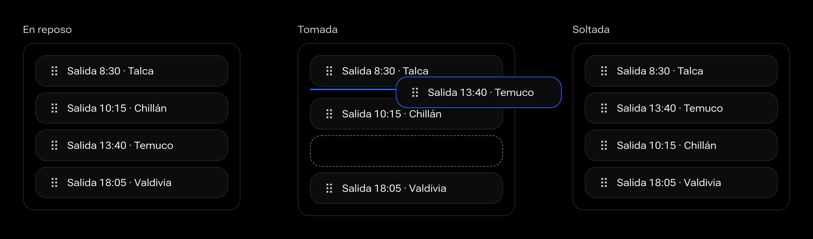

### La alternativa sin arrastrar

Cada cosa que se puede arrastrar tiene además una de estas:

- **Botones «Subir» y «Bajar»** en la fila, para reordenar.
- **Un menú «Mover a…»** con los destinos posibles.
- **«Elegir archivos»**, junto a la zona donde se sueltan: es lo que hace `FileUploader`.

No es un respaldo escondido: está a la vista o a un toque.

### Con teclado

| Tecla | Qué hace |
|---|---|
| Tab | Llega al asa. |
| Espacio | Toma la pieza. |
| Flechas | La mueve un lugar. |
| Espacio | La suelta. |
| Esc | Cancela y la devuelve. |

### Reglas

- **Se actúa al soltar**, no al tomar: hasta ese momento se puede cancelar.
- **Esc cancela** siempre, y soltar fuera de un destino también.
- **Lo movido se puede deshacer** (ver **Deshacer**).
- En una lista larga, la página se desplaza sola al acercar la pieza al borde.
- Al tocar, se toma manteniendo el dedo un momento, para no confundirlo con desplazar.
- Solo se mueve en la dirección que tiene sentido: una lista, hacia arriba y abajo.

### Accesibilidad

- Un lector anuncia cada paso: «Tomaste Salida 8:30. Posición 2 de 4», «Movida a posición 1», «Soltada en posición 1».
- El asa tiene nombre: «Mover Salida 8:30».
- El destino no se distingue solo por color: lleva además la línea o un borde.
- Con movimiento reducido, las filas cambian de lugar sin deslizarse.

### No hagas

- Arrastrar como única forma de hacer algo.
- Hacer arrastrable toda la fila si dentro hay texto que se quiere seleccionar o botones.
- Un destino que no avisa que lo es hasta que se suelta encima.
- Mover al tiro, sin poder cancelar ni deshacer.

### Relacionados

`List` · `FileUploader` · `Table` · Deshacer · Acciones.

## Deshacer

Dejar que una persona se arrepienta, en vez de preguntarle antes si está segura.

### Cuándo

Siempre que una acción se pueda revertir. Dejar deshacer es mejor que pedir confirmación: no interrumpe a quien sabe lo que hace y salva a quien se equivocó.

La confirmación queda para lo que de verdad no tiene vuelta.

### Deshacer o confirmar

| La acción | Qué hacer |
|---|---|
| Se puede revertir: archivar, mover, quitar de una lista, marcar como leído. | Se hace al tiro y se ofrece «Deshacer». |
| No se puede revertir: eliminar una cuenta, enviar un pago, borrar para siempre. | Se confirma antes (ver **Diálogos**). |
| Se puede revertir, pero toca a muchos elementos. | Se hace, se ofrece «Deshacer» y se dice cuántos fueron: «12 viajes archivados». |

Si algo no se puede revertir hoy, considera hacerlo reversible: una papelera en vez de un borrado.

### Cómo se ofrece

Un aviso en `ToastRegion` con lo que pasó y una sola acción:

1. **Qué pasó**, en pasado: «Viaje archivado».
2. **«Deshacer»**, como acción del aviso.

El aviso no tapa lo que la persona estaba haciendo, y deshacer devuelve todo exactamente a como estaba: mismo lugar, mismo orden, misma selección.

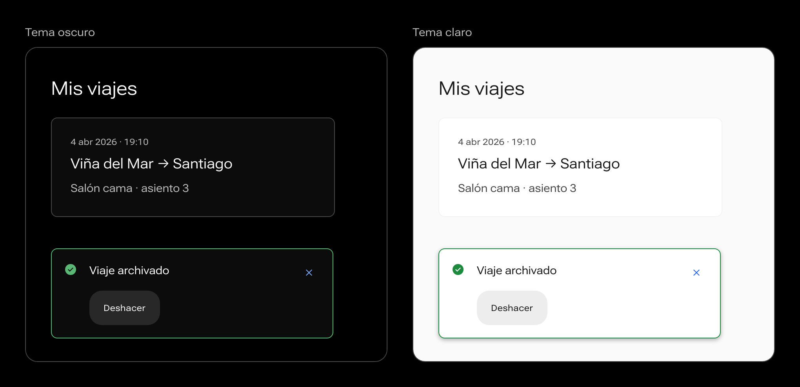

### Cuánto dura

- Un aviso con «Deshacer» se queda más que uno informativo: dale tiempo de sobra para leer y decidir, o déjalo fijo (`duration: 0`) hasta que se cierre.
- El tiempo se detiene mientras el puntero o el foco están sobre el aviso.
- Cuando el aviso se va, la acción sigue teniendo vuelta por otro camino: una sección «Archivados», una papelera.

### En un editor

Donde se escribe o se dibuja, deshacer es una historia de pasos:

- **Deshacer** y **Rehacer** están a la vista, en la `Toolbar`, y responden a las teclas de siempre.
- Cada paso es una acción completa de la persona, no cada letra.
- Los botones se desactivan cuando no hay nada que deshacer o rehacer.
- El nombre dice qué se va a deshacer cuando no es obvio: «Deshacer mover».

### Accesibilidad

- El aviso se anuncia sin quitar el foco de donde estaba.
- «Deshacer» se alcanza con teclado, y hay otra manera de revertir cuando el aviso ya se fue.
- Al deshacer, se anuncia el resultado: «Viaje restaurado».

### No hagas

- Preguntar «¿Estás seguro?» para algo que se deshace con un toque.
- Un «Deshacer» que desaparece antes de que alcance a leerse.
- Deshacer a medias: devolver el elemento, pero no a su lugar.
- Ofrecer «Deshacer» para algo que ya no se puede revertir.

### Relacionados

`ToastRegion` · `Toolbar` · Notificaciones · Diálogos · Arrastrar y soltar.

## Compartir

Dar a otra persona acceso a algo, saber quién lo tiene y poder quitarlo.

### Cuándo

Cuando algo de una persona puede verlo o editarlo otra: un viaje, un documento, una billetera, un tablero.

Lo que alguien crea es privado hasta que decide lo contrario.

### Dos maneras

| Manera | Qué es | Para |
|---|---|---|
| Invitar a personas | Se nombra a quién y con qué permiso. | Trabajo con gente conocida; lo que es delicado. |
| Compartir un enlace | Quien tenga el enlace entra, con el permiso que el enlace da. | Mostrar algo rápido, a varios o a quien no tiene cuenta. |

Ofrece las dos solo si las dos hacen falta. La invitación es la más segura; el enlace, la más cómoda.

### Anatomía

En un `Modal`, o en una `Sheet` en el teléfono:

1. **Título:** qué se comparte. «Compartir Viaje a Talca».
2. **Invitar:** un campo para escribir a quién, su permiso y «Invitar».
3. **Quién tiene acceso:** la lista de personas, cada una con su permiso. Quien comparte aparece primero, como dueño.
4. **Enlace:** si está activo, quién puede entrar con él y un botón «Copiar enlace».

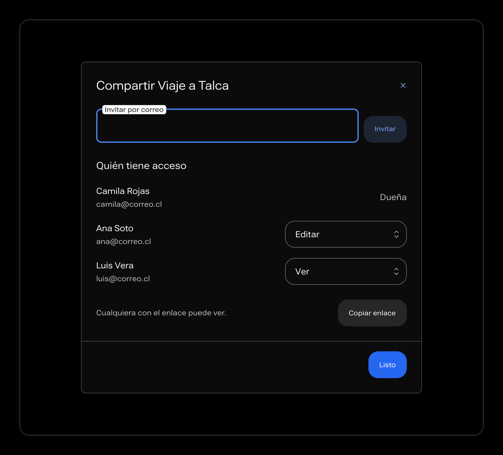

### Permisos

Pocos y con nombres claros, de menos a más:

| Permiso | Qué puede hacer |
|---|---|
| Ver | Mirar, y nada más. |
| Comentar | Mirar y dejar comentarios. |
| Editar | Cambiar el contenido. |
| Administrar | Editar, y además invitar o quitar a otros. |

El permiso por defecto al invitar es el más bajo que sirva: «Ver».

### Reglas

- **Decir qué va a ver la otra persona** antes de compartir, sobre todo si hay datos personales.
- **Confirmar con un aviso**, no con un diálogo: «Enlace copiado», «Invitación enviada a Ana».
- **Quitar el acceso es tan fácil como darlo**: desde la misma lista, y se puede deshacer.
- **Un enlace se puede apagar**, y apagarlo deja sin acceso a quien lo tenía.
- **El estado se ve desde fuera**: lo compartido lleva una señal (un `Tag` «Compartido», las personas con acceso).
- **Copiar siempre funciona.** No dependas de que se abra el correo u otra aplicación: muestra el enlace y deja copiarlo.

### Accesibilidad

- El campo de invitar tiene etiqueta, y sus sugerencias se recorren con las flechas.
- Cada persona de la lista se lee con su nombre y su permiso.
- «Enlace copiado» se anuncia.
- Al cerrar, el foco vuelve al botón «Compartir».

### No hagas

- Compartir por defecto, o con el permiso más alto.
- Un enlace público sin decir que cualquiera con él puede entrar.
- Esconder quién tiene acceso.
- Enviar la invitación sin mostrar a quién ni con qué permiso.

### Relacionados

`Modal` · `Sheet` · `Combobox` · `PopUpButton` · `Tag` · `ToastRegion` · Diálogos · Deshacer.

## Menús

Qué menú usar, cómo se nombran sus ítems y cómo se ordenan.

### Qué menú

Un menú guarda lo que no cabe a la vista. Todos los de ALMA comparten una misma lista, con las mismas reglas; lo que cambia es qué la abre y para qué.

| Necesitas | Usa | Ejemplo |
|---|---|---|
| Elegir una opción entre varias que se excluyen | `PopUpButton` | El tipo de documento: RUT, pasaporte. |
| Acciones relacionadas con un botón | `PullDownButton` | «Agregar»: un pasajero, una maleta, un seguro. |
| Las acciones de un ítem, sin ocupar lugar | `ContextMenu` | Clic derecho sobre un viaje. |
| Las opciones de una acción que la persona ya inició | `ActionSheet` | Al cerrar un mensaje a medias: guardar o descartar. |
| Avisar de algo que la persona no esperaba | `Alert` | «No se pudo guardar». |

Dos reglas para no confundirlos:

- **`ActionSheet` responde a algo que la persona hizo; `Alert` llega sin que lo pida.** Si la persona tocó «Cerrar», lo que sigue es una hoja de acción. Si falló la red, es una alerta.
- **Nada vive solo en un menú contextual.** Está escondido: quien no lo conoce no lo encuentra. Cada acción suya está también a la vista en otro lugar.

### Los ítems

- **Empiezan con verbo** cuando hacen algo: «Copiar número», «Cambiar fecha».
- **Sin artículos:** «Ver pasaje», no «Ver el pasaje». Alargan y no aclaran.
- **Con puntos suspensivos** cuando la acción pide algo más antes de terminar: «Cambiar fecha…» abre un calendario; «Copiar número» no pide nada.
- **Uno que no se puede usar se ve apagado**, no desaparece: así se aprende que existe. La excepción es el menú contextual, que muestra solo lo que aplica.
- **El destructivo va en rojo y al final**, separado. Y pide confirmación con un `ActionSheet`.

### Íconos

- Pocos y con motivo: para las acciones más usadas y para lo que se reconoce de un vistazo (copiar, compartir, eliminar).
- **Todos los ítems de un grupo llevan ícono, o ninguno.** Mezclar desordena la lectura.
- La misma acción lleva el mismo ícono en todo el producto.
- Si no hay un ícono que la represente bien, no lleva.

### Orden y grupos

- **Lo más usado, primero.** Se lee desde arriba.
- **Lo relacionado, junto**, aunque no pese lo mismo: «Pegar» y «Pegar sin formato» van en el mismo grupo.
- **Un separador entre grupos.** No más de tres grupos en un menú contextual.
- **Corto.** Si un menú no se lee de un vistazo, divídelo en dos o usa un submenú. La excepción es una lista que la persona misma llenó, como su historial: esa puede ser larga y desplazarse.
- **Al menos tres ítems** en un `PullDownButton`. Con uno o dos, son botones.

### Submenús

Un ítem puede abrir una lista menor de opciones muy relacionadas. Se reconoce por una flecha al final.

- **Un solo nivel.** Un submenú dentro de otro cuesta abrirlo y se pierde.
- **Hasta unos cinco ítems.** Con más, es otro menú.
- **Cuando una palabra se repite:** en vez de «Ordenar por fecha», «Ordenar por precio» y «Ordenar por destino», un ítem «Ordenar por» con las tres opciones.
- **No indentes ítems** para mostrar jerarquía. Para eso es el submenú.
- `PopUpButton` no lleva submenús: su lista es plana.

### Ítems que se marcan

Un ítem puede ser un atributo que está puesto o no, con un visto delante.

- **Un visto** dice que el atributo está en efecto: «Solo los pagados».
- **O una etiqueta que cambia:** «Mostrar mapa» pasa a «Ocultar mapa». Si no queda claro si es un estado o una acción, agrega el verbo: «Activar avisos», no «Avisos activados».
- **Cuando ayuda ver los dos estados**, muestra los dos ítems y deja disponible solo el que aplica.
- Si se pueden marcar varios, ofrece uno que los quite todos: «Sin filtros».

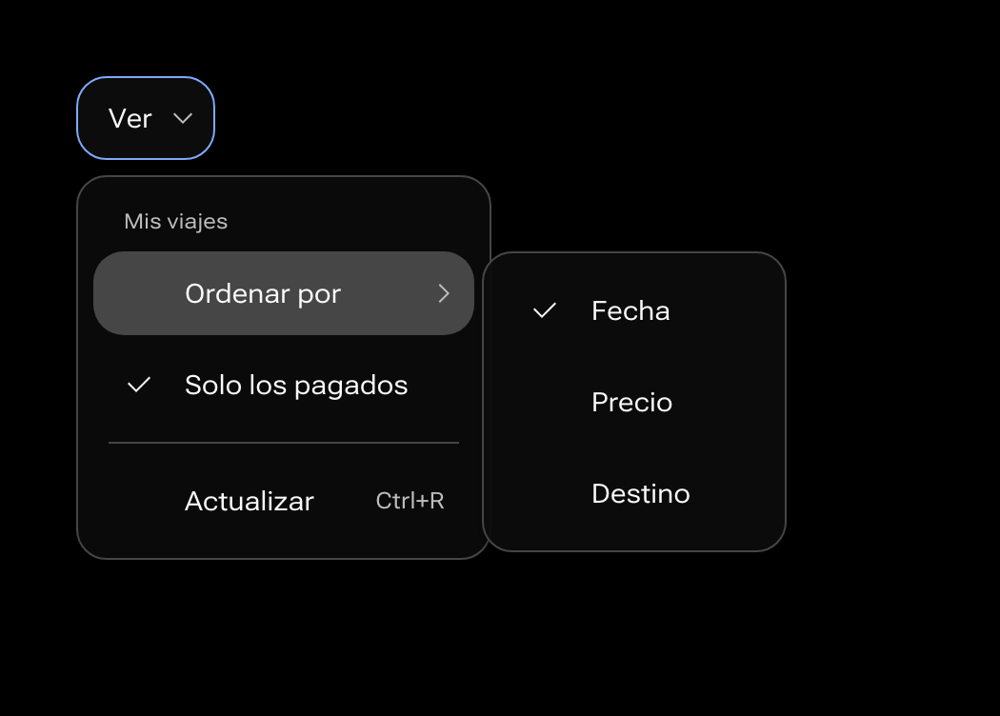

### Atajos de teclado

- Se muestran a la derecha del ítem, en los menús de un botón y en la barra de menús.
- **No en un menú contextual:** ya es un atajo.
- Un atajo que se muestra tiene que funcionar. El menú lo muestra; hacerlo andar es de la app.

### Título

Un menú casi nunca necesita título: el botón y los ítems ya dicen de qué es. Ponlo solo si agrega algo, como cuántos elementos afecta: «3 viajes seleccionados».

### Con el teclado

| Tecla | Qué hace |
|---|---|
| ↓ ↑ | Recorren los ítems, en círculo. Saltan separadores y apagados. |
| Inicio, Fin | Primer y último ítem. |
| → | Abre el submenú. |
| ← | Cierra el submenú y vuelve a su ítem. |
| Enter, Espacio | Elige. |
| Una letra | Va al siguiente ítem que empieza con ella. |
| Esc | Cierra y vuelve a lo que abrió el menú. |
| Tab | Cierra y sigue. |

### Nunca fuera de la pantalla

Un menú se abre bajo su botón. Si no cabe, se abre hacia arriba o se alinea al otro lado. Un menú contextual se abre en el punto donde se pidió y se corre lo necesario para quedar entero.

### No hagas

- Meter todas las acciones de una pantalla en un solo menú «Más». Las principales van a la vista.
- Un menú con un solo ítem.
- Cambiar el orden de los ítems según el uso. La gente los encuentra por su lugar.
- Usar un menú para navegar entre secciones. Para eso están `Tabs`, `Sidebar` y `TabBar`.

### Relacionados

`PopUpButton` · `PullDownButton` · `ContextMenu` · `ActionSheet` · `Alert` · `Toolbar` · Acciones · Diálogos.

### Referencias

- Apple, Human Interface Guidelines: Menus, Context menus, Pop-up buttons, Pull-down buttons, Action sheets.

## Entorno

Un escritorio que corre en el navegador: ventanas, barra de menús, dock, y dónde vive la IA.

### Qué es

Cada entidad de ALMA puede tener su propio entorno: un escritorio donde sus apps se abren en ventanas, con una barra de menús arriba y un dock abajo. Corre en el navegador. Las piezas son las mismas para todas las entidades; cambian el color, la letra, la voz y la luz.

Es para cuando una persona trabaja con varias cosas a la vez y las quiere ver juntas. Una sola tarea, de principio a fin, sigue siendo una página.

### Las piezas

| Pieza | Componente | Qué hace |
|---|---|---|
| **Escritorio** | `Desktop` | El escenario. Lleva el fondo, ordena las ventanas y sabe si la pantalla es angosta. |
| **Ventana** | `Window` | El marco de una app: se mueve, cambia de tamaño, se minimiza, se amplía y se cierra. |
| **Barra de menús** | `MenuBar` | Todos los comandos de la app que está al frente. A su derecha, los extras. |
| **Dock** | `Dock` | Las apps, a un toque. Dice cuáles están abiertas. |

Y fuera de las ventanas, para ver sin abrir:

| Pieza | Componente | Qué hace |
|---|---|---|
| **Widget** | `Widget` | Una idea de una app sobre el escritorio, para leer de un vistazo. |
| **Actividad en vivo** | `LiveActivity` | Algo con principio y fin, seguido desde la barra de menús o sobre el escritorio. |
| **Fragmento** | `Snippet` | La respuesta del asistente como tarjeta: un resultado, o una confirmación. |

Además, lo que ya existía: `ContextMenu` sobre cualquier ítem, `Sheet` y `Alert` dentro de una ventana, `ToastRegion` para los avisos.

### Las capas

De atrás hacia adelante. Sigue el fundamento Profundidad.

| Nivel | Qué | De qué |
|---|---|---|
| 0 | El fondo del escritorio. Puede ser un efecto de ALMA. | Opaco, o un efecto. |
| 1 | Los widgets, sobre el fondo y bajo las ventanas. | Vidrio medio. |
| 1 | Las ventanas. El cuerpo es contenido; la barra es de la capa funcional. | Cuerpo en `ui-02`. Barra de vidrio en la ventana activa. |
| 2 | La barra de menús y el dock. | Vidrio delgado y vidrio medio. |
| 3 | Menús, popovers y avisos. | Como siempre. |

El fondo no lleva texto. Todo lo que se lee está en una ventana, en la barra o en el dock.

### Ventanas

- **Una está al frente.** Es la que recibe el teclado. Se nota: su barra es de vidrio, sus controles tienen color pleno y lleva sombra. Las demás se apagan un tono.
- **Principal o auxiliar.** La principal lleva la navegación de la app. Una auxiliar es para una sola tarea (escribir un mensaje, ver un pasaje) y se cierra al terminar.
- **Panel.** Una ventana menor que flota junto a otra: el detalle de lo seleccionado. Es toda de vidrio.
- **Abre una ventana nueva cuando ayuda ver dos cosas a la vez**: escribir mientras se lee. No por defecto: muchas ventanas son desorden.
- **Recuerda su lugar.** Una ventana que se cierra vuelve donde estaba y del tamaño que tenía.
- **Nada importante abajo.** El borde inferior es lo primero que queda fuera de la vista al mover una ventana. El pie de una ventana es para un dato menor: «2 viajes».
- **Se llama ventana.** En los textos, siempre esa palabra.

### La barra de menús

Los menús van siempre en el mismo orden. La gente los encuentra por su lugar.

| Menú | Qué lleva |
|---|---|
| **El nombre de la app**, en negrita | Lo que vale para toda la app: «Acerca de», «Ajustes…». |
| **Archivo** | Crear, abrir, guardar, imprimir, cerrar la ventana. |
| **Edición** | Deshacer, rehacer, cortar, copiar, pegar, buscar. |
| **Formato** | Solo si la app tiene texto con formato. |
| **Ver** | Cómo se muestra: ordenar, filtrar, mostrar u ocultar partes. |
| Los propios de la app | Entre Ver y Ventana. Títulos de una palabra. |
| **Ventana** | Minimizar, ampliar y la lista de ventanas abiertas. |
| **Ayuda** | La ayuda de la app. |

- **Todo comando de la app está aquí**, incluidos los de sus menús contextuales. Es donde se aprende qué hace la app.
- **Siempre los mismos ítems.** El que no se puede usar se ve apagado; no desaparece.
- **Con sus atajos**, que funcionan.

A la derecha van **los extras**: la hora, los avisos, la conexión, la presencia de la IA. Un extra que se toca abre un menú, no un popover. Son pocos, y la persona elige cuáles ver.

### El dock

- **Las apps que más se usan**, y las que están abiertas. Un punto bajo las abiertas.
- **Tocar una app** la abre, o trae su ventana al frente.
- **Su menú** (clic derecho o toque largo) tiene sus atajos: «Nuevo viaje», «Salir». Nada vive solo ahí.
- **Un contador** sobre el ícono dice cuánto hay sin ver. Solo para lo que la persona pidió seguir.

### En una pantalla angosta

Bajo 672 px de ancho no hay espacio para ventanas que se superponen:

- Se ve **una ventana a la vez**, a todo el tamaño.
- No se mueven ni cambian de tamaño. Queda el control de cerrar.
- La barra muestra solo el menú de la app.
- El dock sigue abajo, y con él se cambia de app.

Es el mismo entorno, con las mismas apps en el mismo estado. Al ensanchar, las ventanas vuelven a su lugar.

### Dónde vive la IA

La guía Interfaces de IA pide una sola luz por pantalla. En el entorno hay tres lugares para ella, de más a menos presencia:

| Lugar | Qué | Cuándo |
|---|---|---|
| **El fondo del escritorio** | El escenario: el Velo, detrás de todo, y el Halo sobre él cuando la IA pasa al frente. | Cuando la IA es el centro del entorno. El Halo dice su estado. |
| **Un extra de la barra** | La figura: el Halo pequeño, o el ícono `ai-label`. | Cuando el fondo es otro. Abre el asistente. |
| **Una ventana** | El asistente: `ChatMessage` y `PromptInput`. | Donde se conversa. |

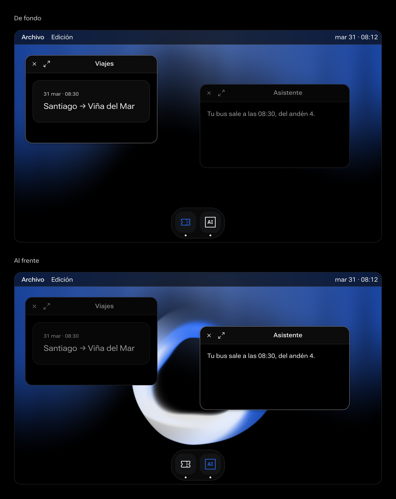

**El Halo es de primer plano.** Mientras la IA está de fondo, su luz es solo el Velo: quieto, tenue y barato de dibujar. Cuando la ventana del asistente pasa al frente, el Halo aparece sobre el Velo; cuando deja de estarlo, se retira. `Window` avisa con `onActiveChange`.

#### El asistente a pantalla completa

Es el escenario de la IA: su espacio. Al ampliar la ventana del asistente (`Window` con `kind: 'stage'`), el entorno se ordena en tres capas.

| Capa | Qué | Regla |
|---|---|---|
| **El suelo** | El Velo, de lado a lado. La ventana no tiene fondo propio. | Es la misma luz del escritorio, no otra. Las demás ventanas esperan fuera de la vista. |
| **La zona despejada** | Arriba, el Halo. Dice el estado: en reposo, escuchando mientras se escribe, pensando, respondiendo. | Sin texto ni controles encima. Mide 160 px de alto como mínimo. |
| **La hoja** | Abajo y al centro, vidrio grueso: el saludo y las sugerencias, o la conversación, y la caja de pedido. | Ancho de lectura, 44 rem como mucho. Crece hacia arriba con la conversación y se desplaza por dentro. |

- **Lo que se lee va siempre sobre la hoja.** El vidrio grueso admite los tres niveles de texto sobre cualquier luz.
- **El Halo se achica y sube** a su zona; al volver a ventana flotante regresa al centro. El paso dura `duration-slow-02`.
- **Si otra ventana pasa al frente,** el asistente recupera su fondo y el Halo se retira.
- **En alto contraste o con menos transparencia,** la hoja es opaca. La luz sigue detrás y nada depende de ella.

Si el fondo ya es la luz de la IA, el extra de la barra es solo el ícono. Nunca dos luces.

Lo que la IA hace fuera de su ventana tiene dos piezas: una tarea larga se sigue con una `LiveActivity`, que muestra sus pasos y siempre deja detenerla; y cuando necesita permiso, o responde con un dato, lo hace con un `Snippet`.

### Con el teclado

| Tecla | Dónde | Qué hace |
|---|---|---|
| Tab | En todo el entorno | Barra de menús, ventana al frente, dock. |
| ← → | En la barra de menús | Pasa de un menú a otro. |
| ↓, Enter | En un menú de la barra | Lo abre. |
| Flechas | En la barra de una ventana | Mueven la ventana. |
| Mayúsculas + flechas | En la barra de una ventana | Cambian su tamaño. |
| ← → | En el dock | Pasa de una app a otra. |
| Tecla de menú | Sobre una app del dock | Abre su menú. |

Mover y cambiar de tamaño nunca dependen de arrastrar: siempre hay teclado, y «Ampliar» y «Minimizar» están en los controles y en el menú Ventana.

### No hagas

- Dibujar ventanas propias, con otros controles u otro orden. La gente reconoce la ventana por su marco.
- Abrir una ventana por cada cosa.
- Poner texto sobre el fondo del escritorio.
- Esconder comandos fuera de la barra de menús.
- Hacer que una ventana se abra más grande que el escritorio, o fuera de él.

### Relacionados

`Desktop` · `Window` · `MenuBar` · `Dock` · `Widget` · `LiveActivity` · `Snippet` · `ContextMenu` · Menús · Profundidad · Interfaces de IA · Diseño adaptable.

### Referencias

- Apple, Human Interface Guidelines: Windows, The menu bar, Dock menus, Panels.

## Jerarquía

Qué se lee primero: los niveles del texto, el peso de los botones y los márgenes que agrupan.

### Para qué

Una pantalla se entiende cuando se nota qué es lo principal, qué lo acompaña y qué va junto. Eso lo dicen tres cosas, antes que cualquier adorno: **el color del texto, el peso de los botones y los márgenes**. Cuando están bien, nadie las ve. Cuando están mal, todo pesa lo mismo.

### Los niveles del texto

Cada nivel tiene un trabajo. Se elige por el trabajo, no por cómo se ve.

| Nivel | Token | Trabajo | Ejemplos |
|---|---|---|---|
| **Principal** | `text-01` | Lo que se vino a leer. | Títulos, el valor de un dato, el texto de un párrafo, lo escrito en un campo. |
| **Secundario** | `text-02` | Lo que ayuda a entender lo principal. | Bajadas, el nombre de un dato, ayudas de un campo, fechas, de cuándo es algo. |
| **Terciario** | `text-03` | Lo que todavía no está. | El texto de ejemplo de un campo, un paso por hacer. |

Reglas:

- **Un dato tiene dos niveles:** su nombre en `text-02` y su valor en `text-01`. «Sale» en secundario, «08:30» en principal. Nunca al revés.
- **La ayuda de un campo es secundaria**, no principal. Si compite con lo que la persona escribe, está mal.
- **Tres niveles alcanzan.** Un cuarto tono de gris no se distingue del tercero.
- **El nivel no reemplaza al tamaño ni al peso:** van juntos. Un título es grande, con peso y principal; una nota al pie es chica y secundaria.
- **El color de acento no es un nivel de texto.** Es de lo que se puede tocar. Un texto azul que no es enlace confunde.
- **El texto desactivado** no es un cuarto nivel: es el control entero, apagado.
- **Sobre vidrio**, cada grosor admite sus niveles. Ver Profundidad.

En el tema claro los tres niveles estaban casi juntos (9,4 · 6,7 · 5,7 a 1 sobre la superficie). Ahora el principal es la tinta de marca y quedan en 17,6 · 9,4 · 5,7. En el oscuro ya estaban separados: 18,7 · 10,4 · 6,2.

### El peso de los botones

Cuatro pesos, de más a menos. Se elige por cuánto importa la acción en **esa** vista.

| Peso | Estilo | Para | Cuántos |
|---|---|---|---|
| 1 | `filled` | La acción que casi todos van a elegir. Relleno de acento. | Uno por vista. Dos, como mucho. |
| 2 | `tinted` | La segunda acción que importa. El acento, tenue. | Uno por grupo. |
| 3 | `gray` | Lo neutro: «Cancelar», «Volver». Un gris tenue. | Los que hagan falta. |
| 4 | `plain` | Lo repetido y lo menor: acciones en filas, barras, enlaces de acción. Solo texto. | Los que hagan falta. |

Reglas, de Apple:

- **El estilo distingue, no el tamaño.** Dos botones juntos miden lo mismo; el preferido se nota por su estilo. Dos tamaños juntos se leen como un error.
- **Una acción que destruye nunca es la principal.** Aunque sea la más probable. La gente aprieta el botón más visible sin leerlo: ese tiene que ser el seguro. «Eliminar» va en `tinted` con rol destructivo, y «Cancelar» recibe el foco.
- **Enter es del principal.** Por eso el principal no puede destruir.
- **Con espacio alrededor.** 44 px de área de toque, y `space-8` entre botones.
- **Mientras trabaja, lo dice en el botón:** «Pagando…», con su indicador.

El orden es el de Apple, y se nota a simple vista: cada peso contrasta menos con el fondo que el anterior. El `gray` es un gris tenue y neutro, igual en todas las entidades. Hasta octubre de 2026 era un relleno sólido y oscuro que en el tema claro pesaba más que el botón principal; por eso se cambió.

La marca en su paso más oscuro sigue existiendo como color (`interactive-02`), para acentos profundos. Ya no es un botón.

### Los márgenes

El espacio dice qué va con qué. Mientras más relacionadas dos cosas, más cerca.

| Relación | Espacio | Ejemplo |
|---|---|---|
| Partes de una misma cosa | `space-4` | Un ícono y su texto. El nombre de un dato y su valor apilados. |
| Cosas relacionadas | `space-8` | Un título y su bajada. Un campo y su ayuda. Dos botones. |
| Elementos de un grupo | `space-16` | Campos de un formulario. Filas de datos. El borde de una pieza chica. |
| Grupos | `space-24` | Dos grupos de campos. El borde de una tarjeta o un panel. |
| Secciones | `space-32` o más | Dos secciones de una página. |

Reglas:

- **Lo de adentro va más junto que lo de afuera.** El espacio entre las partes de una tarjeta es menor que su margen. Si es igual, la tarjeta se deshace.
- **Un margen por contenedor.** Todo lo que está dentro de una pieza parte del mismo borde izquierdo: título, texto, botones. Un botón que empieza 8 px más adentro que el título se nota.
- **Alinea por el texto, no por la caja.** Un botón `plain` tiene relleno invisible: se corre hacia afuera para que su texto calce con el del párrafo.
- **Radios concéntricos.** Una forma dentro de otra lleva el radio de afuera menos el margen. Dentro de un panel de radio 16 con margen 8, lo de adentro lleva radio 8. Un radio interior mayor que el exterior se ve hinchado.
- **Lo importante arriba y al inicio.** Se lee de arriba abajo y de izquierda a derecha.
- **La sangría dice jerarquía.** Algo corrido hacia adentro depende de lo de arriba. No la uses para decorar.
- **Agrupa con espacio antes que con líneas.** Una línea o una caja, solo cuando el espacio no alcanza.

### Lista de comprobación

- ¿Se nota cuál es el dato principal sin leer?
- ¿Hay un solo botón `filled`?
- ¿El botón más visible es seguro?
- ¿Todo parte del mismo borde izquierdo?
- ¿El espacio dentro de cada grupo es menor que el espacio entre grupos?
- ¿Algún radio interior es mayor que el de su contenedor?
- ¿Se entiende igual en el tema claro?

### Relacionados

`Button` · Color · Espaciado · Tipografía · Profundidad · Acciones · Formularios.

### Referencias

- Apple, Human Interface Guidelines: Layout, Typography, Color, Buttons, Materials.

## Elegir un componente

Cuál usar cuando varios se parecen: una tabla por familia.

### Para qué

ALMA tiene 75 componentes, y varios hacen cosas parecidas. Esta página dice cuál va en cada caso. Se entra por lo que necesitas, no por el nombre de la pieza.

### Mostrar avance, o una medida

| Necesitas | Usa |
|---|---|
| Decir que algo carga, sin saber cuánto falta | `ActivityIndicator` |
| Mostrar cuánto falta de una tarea | `ProgressBar` |
| Mostrar la forma de lo que va a llegar | `Skeleton` |
| Decir en qué paso de un flujo se está | `ProgressIndicator` |
| Un avance fino, pegado a un borde | `ProgressLine` |
| Un valor dentro de un rango: cuánto hay, dónde está | `Gauge` |
| Seguir algo que dura, fuera de su app | `LiveActivity` |

La diferencia que más se confunde: **`ProgressBar` mide algo que está pasando; `Gauge`, algo que es.**

### Detener, preguntar, confirmar

| Necesitas | Usa |
|---|---|
| Avisar de algo que la persona no esperaba | `Alert` |
| Ofrecer cómo seguir una acción que la persona inició | `ActionSheet` |
| Una tarea corta que pide atención completa | `Modal` |
| Una tarea que acompaña a la pantalla, o en un teléfono | `Sheet` |
| El permiso de un agente de IA antes de actuar | `Snippet`, de confirmación |
| Algo que se puede deshacer | Nada de lo anterior: actúa y ofrece «Deshacer» en `ToastRegion` |

### Avisar sin detener

| Necesitas | Usa |
|---|---|
| Un aviso que pertenece a un lugar de la página | `InlineNotification` |
| Un aviso breve de algo que acaba de pasar | `ToastRegion` |
| Una pantalla sin contenido todavía | `EmptyState` |
| El estado de un ítem | `Tag` |

### Explicar algo junto a un control

| Necesitas | Usa |
|---|---|
| El nombre de un botón que solo tiene ícono | `Tooltip` |
| Una explicación con texto, enlaces o un botón | `Popover` |
| Enseñar una función nueva, una vez | `Tip` |
| Decir que algo lo generó una IA, y explicarlo | `AILabel` |

### Elegir una opción

| Necesitas | Usa |
|---|---|
| Sí o no, con efecto inmediato | Una fila de `List` con su interruptor |
| Sí o no, dentro de un formulario que se envía | `Checkbox` |
| Una de dos a cuatro, todas a la vista y cortas | `SegmentedControl` |
| Una de tres a cinco, con texto que explicar | `RadioGroup` |
| Una de muchas | `PopUpButton` |
| Una de muchísimas, escribiendo para encontrarla | `Combobox` |
| Varias, de una lista corta | `Checkbox` en grupo, o `List` con vistos |
| Varias, escribiéndolas | `TokenField` |
| Un número, de a pasos | `Stepper` |
| Un valor aproximado en un rango | `Slider` |
| Una opinión | `Rating` |

### Escribir

| Necesitas | Usa |
|---|---|
| Un dato corto | `TextInput` |
| Un texto largo | `Textarea` |
| Buscar | `SearchField` |
| Un código de verificación | `DigitEntry` |
| Una fecha, o una hora | `DatePicker`, `TimePicker` |
| Pedirle algo a una IA | `PromptInput` |

### Ofrecer acciones

| Necesitas | Usa |
|---|---|
| La acción principal, a la vista | `Button` |
| Ir a otra parte | `Link` |
| Varias acciones de un botón | `PullDownButton` |
| Las acciones de un ítem, sin ocupar lugar | `ContextMenu`, y también en otro lugar a la vista |
| Acciones sobre un texto seleccionado | `EditMenu` |
| Todos los comandos de una app, en un escritorio | `MenuBar` |

### Moverse

| Necesitas | Usa |
|---|---|
| Las secciones de una app, en un teléfono | `TabBar` |
| Las secciones de una app, en pantalla ancha | `Sidebar` |
| Vistas de un mismo contenido | `Tabs` |
| El título y las acciones de una pantalla | `Toolbar` |
| Mostrar el camino hasta aquí | `Breadcrumb` |
| Pasar entre páginas de resultados | `Pagination` |
| Pasar entre pocas pantallas, deslizando | `PageControl` |

### Mostrar una jerarquía

| Necesitas | Usa |
|---|---|
| Hasta dos niveles, para navegar una app | `Sidebar` |
| Varios niveles que se abren y se cierran | `Outline` |
| Muchos niveles, viendo por dónde se vino | `ColumnView` |
| Una lista y el detalle de lo elegido | `SplitView` |
| Partes de un contenido que se despliegan | `Accordion` |

### Agrupar contenido

| Necesitas | Usa |
|---|---|
| Un tema, con su título y sus acciones | `Card` |
| Un producto, con precio | `ProductCard` |
| Un medio de pago | `PaymentCard` |
| Filas de texto | `List` |
| Datos que se comparan en columnas | `Table` |
| Ítems que se miran más que se leen | `Collection` |
| Un poco de una app, fuera de ella | `Widget` |
| La respuesta de una IA como tarjeta | `Snippet` |

La regla general: **texto en filas, imágenes en grilla, números en tabla.**

### Mostrar datos

| La pregunta | Usa |
|---|---|
| ¿Cuánto es? | El número, grande |
| ¿Cuál es mayor? | `BarChart` |
| ¿Cómo cambió? | `LineChart` |
| ¿Se relacionan? | `ScatterChart` |
| ¿Cuánto hay de un total? | `Gauge` |
| ¿Cuál es el valor exacto? | `Table` |

### Si ninguno calza

Antes de crear uno nuevo: ¿se resuelve con uno de estos y un patrón? Casi siempre sí. Si de verdad falta, se propone como una pieza de ALMA, no como algo de una sola pantalla.

### Relacionados

Jerarquía · Menús · Diálogos · Acciones · Formularios · Notificaciones · Carga · Entorno · Gráficos de datos.
